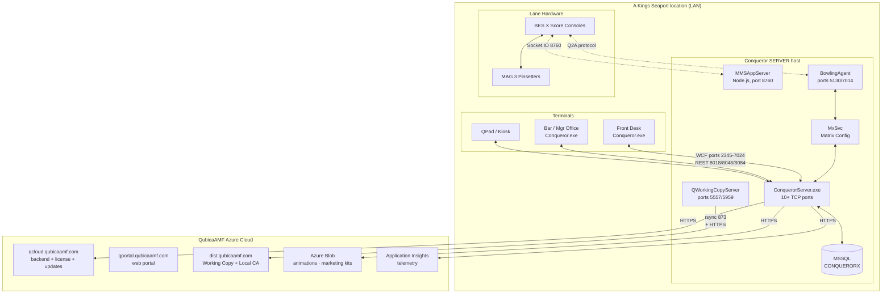

# Architecture

## Deployment topology (Mermaid)



## Deployment topology (ASCII, for terminals without Mermaid)

```
┌───────────────────────────────────────────────────────────────────────┐
│                     A Kings Seaport location                          │
│                                                                       │
│   ┌────────────────────┐         ┌─────────────────────────────┐     │
│   │  Terminal 1        │         │  Conqueror SERVER host      │     │
│   │  Conqueror.exe     │◄───────►│                             │     │
│   │  (front desk PC)   │  TCP    │  ConquerorServer.exe        │     │
│   └────────────────────┘  many   │  MMSAppServer (node)        │     │
│                          ports   │  QWorkingCopyServer         │     │
│   ┌────────────────────┐         │  MxSvc (Matrix Config)      │     │
│   │  Terminal 2        │────────►│  BowlingAgent               │     │
│   │  (bar / manager)   │         │                             │     │
│   └────────────────────┘         │  ┌──────────────────────┐   │     │
│                                  │  │  MSSQL$CONQUERORX    │   │     │
│   ┌────────────────────┐         │  │  (SQL Server named)  │   │     │
│   │  QPad / kiosk      │────────►│  └──────────────────────┘   │     │
│   └────────────────────┘         └─────────────┬───────────────┘     │
│                                                │                       │
│   ┌────────────────────┐                       │                       │
│   │  Score displays    │◄──────────────────────┤                       │
│   │  BES X consoles    │  Socket.IO (8760)     │                       │
│   │  Lane hardware     │                       │                       │
│   └────────────────────┘                       │                       │
└────────────────────────────────────────────────┼───────────────────────┘
                                                 │
                                                 │ HTTPS
                                                 ▼
                        ┌────────────────────────────────────┐
                        │   QubicaAMF Cloud (Azure)          │
                        │                                     │
                        │   qcloud.qubicaamf.com  ← backend  │
                        │   qportal.qubicaamf.com ← web portal│
                        │   dist.qubicaamf.com    ← updates, │
                        │                            local CA │
                        │   *.blob.core.windows.net ← assets  │
                        └────────────────────────────────────┘
```

## The Server vs Terminal distinction

Chosen at install time; irreversible without a full reinstall.

- **SERVER:** hosts the SQL Server instance, `ConquerorServer.exe`, the
  MMS Node.js layer, working copy server, licensing dongle. Typically one
  per center, sometimes two for hot standby ("spare server").
- **TERMINAL:** front-desk PC, bar PC, manager office PC. Runs
  `Conqueror.exe` only. Connects to the SERVER by IP/hostname; the terminal
  number is chosen on first login and registered against the server.

Our test box was originally installed as TERMINAL, then had SERVER added on
top. The installer at
`C:\ProgramData\QubicaAMF\Repositories\Conqueror\15.18.0+22859\Repository\ConquerorSetup.exe`
supports both roles.

**Confirmed live at Kings Seaport (2026-08-26):** a read-only diagnostic
capture from a terminal named `FRONTDESK1` showed `ConquerorServer` and
`MxSvc` both `Stopped`, while `MSSQL$CONQUERORX` was `Running`. A port
check confirmed only 5130 and 7014 (BowlingAgent, lane hardware comms)
were listening locally, none of ConquerorServer's ports (2345, 2387,
3535, 5555, 5556, 6767, 7024, 8018, 8048, 8084) or MMS's 8760. This
matches the TERMINAL role exactly: `FRONTDESK1` runs the client shell and
connects out to wherever the SQL Server instance and ConquerorServer
actually live. Kings runs at least a two-machine topology, a dedicated
server host plus one or more front-desk terminals, not the combined
single-box setup our dev test install uses. The server host itself has
not yet been identified; running the same capture on the back-office PC
would confirm it by showing `ConquerorServer` and `MxSvc` as `Running`
there instead.

## Update distribution: the Working Copy system

Neither of the two Conqueror components is patched directly. Instead:

1. **Working Copy** on the server (`QWorkingCopyServer.exe`, ports 5557 + 5959)
   pulls the "next" version from `dist.qubicaamf.com` and stores it locally
   in `C:\ProgramData\QubicaAMF\Repositories\Conqueror\<version>\Repository\`.
2. Terminals rsync their in-use copy from the server at a maintenance window,
   over port 873 (yes, actual rsync running on Windows).
3. Version has to be identical across all terminals + server. Mixed versions
   are refused.
4. Certificates are pulled from `dist.qubicaamf.com/localca/QubicaAMF-LocalCA.cer`
, QubicaAMF operates its own CA for internal HTTPS trust.

This is why the AutoHotkey helper on our USB drive is safe (it doesn't touch
these paths) but also why manual patching of Conqueror files is dangerous
(next sync overwrites).

## Environments and channels

The installed ConquerorX ships with **22 environment configurations**
(`qdesk-settings/*.json`), covering QubicaAMF's own SDLC pipeline:

| Environment | Purpose |
|---|---|
| `production` | Live customer sites |
| `staging` | Pre-release gates |
| `expo` | Trade-show demos |
| `development` | QubicaAMF internal dev |
| `testing-slot-01`…`testing-slot-05` | Rotating QA slots |

Each has `stable` and `beta` channels. Each points at a distinct
`cloudBackendUrl` and `qportalUrl`, and carries its own Azure Application
Insights instrumentation key for telemetry.

**The Kings live install runs `production`/`stable`.** Anything else on the
work terminal would be a red flag.

## Runtime layers on the SERVER host

Ordered outside-in:

| Layer | Tech | What runs there |
|---|---|---|
| Windows service | Native | `MxSvc` (Matrix Configuration Server), `QWorkingCopyServer`, `MSSQL$CONQUERORX`, `WorkingCopyUpdater`, `SQLBrowser` |
| Business services | .NET Framework 4.7.2 (`ConquerorServer.exe`) | Reservations, Customers, Bowling, Lanes, Payments, Security, Attractions, Loyalty, one process, many `Qbk.*.Server.dll` modules |
| Web layer | ASP.NET Core 2.3 (in-process inside `ConquerorServer.exe`) | REST endpoints, static file serving, evidence: `Microsoft.AspNetCore.*` DLLs |
| MMS communication | Node.js (bundled toolchain in `node-builds/`) | Score display comms, `mms_communication.js`, Socket.IO |
| Print engine | Crystal Reports runtime | `ReportViewerApp.exe`, 60+ `.rpt` templates |
| Cloud sync | HTTPS out to Azure | QCloud, QPortal, Blob storage |
| Telemetry | Azure Application Insights | Baked into every environment tier |

## Runtime layers on a TERMINAL

Ordered outside-in:

| Layer | Tech | What runs there |
|---|---|---|
| Windows service | Native | `WorkingCopyUpdater` |
| Client shell | .NET Framework 4.7.2 (`Conqueror.exe`) | The whole front-desk UI, Windows Forms |
| Score UI extensions | Native COM interop, DirectShow | AForge camera libs, video capture |
| Plugin host | Own runtime | Loads `Qbk.*.Plugin.dll` and `RoutingDefs.json` cloud plugins |

The client and server share the same `Qbk.*` DLLs, `Qbk.Reservations.Client.dll`
is loaded by the terminal, `Qbk.Reservations.Server.dll` by the server, both
share `Qbk.Reservations.dll` for shared types.

## Reference

- Filesystem details: [`02-filesystem-layout.md`](02-filesystem-layout.md)
- Every service and port: [`03-services-and-processes.md`](03-services-and-processes.md)
- Every DLL grouped: [`04-modules-and-dlls.md`](04-modules-and-dlls.md)
- Cloud endpoints and API surface: [`07-network-and-api.md`](07-network-and-api.md)
