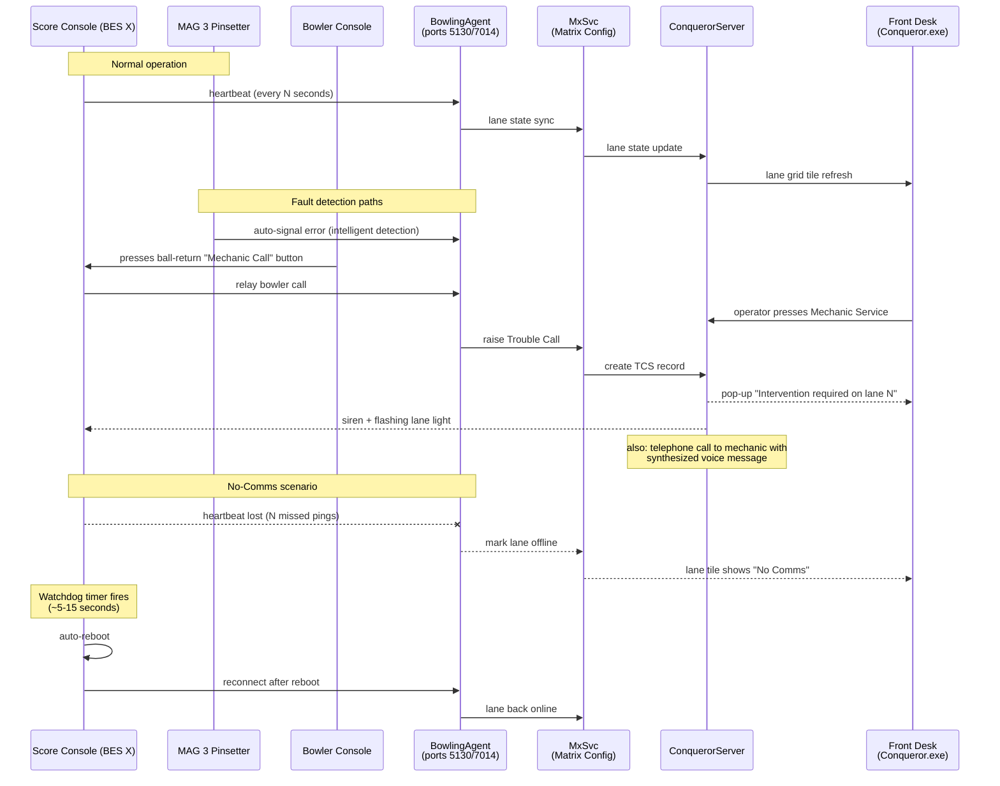

# Operations & Troubleshooting Log

Living record of real ConquerorX incidents observed at Kings Seaport, with
diagnosis and resolution. Both a reference (what does this alert mean?) and
an incident log (has this happened before? how often?).

## How to use this doc

**When something goes wrong on a shift:**

1. Scan the "Known incident patterns" section for a match by symptom.
2. If found, follow the diagnosis + resolution steps.
3. If not found, log it in the "New incidents" section at the bottom with
   as much detail as you can capture (time, lanes involved, what the guests
   were doing, exact error text).
4. Later, someone (Carlos + Claude) turns new incidents into new "Known
   patterns" as we learn what they mean.

**Field entry template:** copy into a new incident:

```markdown
### Incident: <one-line summary>
- **When:** YYYY-MM-DD HH:MM ET
- **Lanes / terminals:** e.g. lanes 13-14, front desk terminal 1
- **Symptom:** what did staff / guests see
- **In-progress activity:** who was on those lanes doing what
- **Exact message text (if any):** verbatim
- **Duration:** how long from onset to normal
- **Recovery action:** what fixed it (or "self-recovered")
- **Guest impact:** none / minor / had to comp
- **Follow-up:** what still needs to happen (ticket to QubicaAMF, etc.)
- **Diagnosis (added later):** root cause once known
```

---

## The comm chain (authoritative)

Mapped from `Conqueror-2-386.html` (TCS Overview) and the DLL family under
`Qbk.Lanes.*`.



## Known incident patterns

### Pattern A: "No comms" on a pod, both lanes reset together

**Symptom:** two paired lanes (e.g. 13/14, 15/16) show "No Comms" simultaneously
in the front-desk lane grid, then their score consoles reboot on their own.

**What's happening:** the pod's score console lost heartbeat with the
BowlingAgent daemon on the server, hit its watchdog timeout (~5-15 seconds
of missed pings), and rebooted itself as a recovery. This is built-in
QubicaAMF behavior, not a bug, it's the console's "I've lost my brain,
restart" reflex.

**Comm chain that was interrupted:**
```
Score console → Q2A protocol → BowlingAgent (server 5130/7014)
             → MxSvc → ConquerorServer → Front-desk UI
```

**Most likely root cause, ranked:**

1. **Network glitch or physical UTP cable damage on the pod's cable/switch:**
   Two paired lanes share a network run; a flap or bump takes both
   down. Self-recovers when link returns. **Confirmed at Kings on
   2026-08-26** (incident C1): a UTP cable powering SuperTouch #13
   had been routed under the ball return motor at initial assembly
   and gradually worn through, causing intermittent link loss that
   damaged both the SuperTouch and the 5HD HUB. When Pattern A
   repeats on the same pod, inspect the cable routing for contact
   with moving mechanical parts before assuming it's a switch flap.
2. **Console hard-locked:** bad game state (weird pinfall pattern) froze the
   console. Watchdog kicked in.
3. **Pinsetter fault:** jam trip or overcurrent → pinsetter controller
   reboots → score console loses hardware → resets.
4. **Power dip on the pod:** a lone pod power blip.
5. **BowlingAgent hiccup on the server:** GC pause or brief crash. Would
   affect more pods, so less likely if only 13/14.
6. **Working Copy sync at wrong time:** very rare mid-shift.

**Immediate action:**

1. Give it 60-90 seconds, consoles usually reconnect on their own.
2. Verify in the lane grid that 13/14 return to "Ready" or "In Session".
3. Check with guests on the lanes, did their session/scores restore?
   (They usually do; scores are persisted server-side.)
4. If TCS (Trouble Call System) fired, dismiss / resolve those tickets.

**Follow-up if repeated (>1× per week on the same pod):**

- Ask maintenance to inspect the pod's network cable and switch port.
- Ask maintenance to inspect the pinsetter for intermittent faults.
- File a QubicaAMF support ticket including the SystemLog entries around
  the incident times.

**How to check the logs (needs SQL access):**
- Table: `SystemLog` (in the ConquerorX DB, populated by `qsp_log_insert`)
- Filter by timestamp ± 2 minutes of the incident
- Look for entries mentioning "lane 13", "lane 14", "heartbeat", "no comms",
  "reconnect"
- Also check `LaneHistory` for state transitions (OFF → ON) on 13/14
- `C:\ProgramData\QubicaAMF\BowlingAgent\Logs\` on the server for BA-side
  connection logs

**First observed:** 2026-08-24 mid-shift at Kings Seaport (see incident C1
below). **Root cause confirmed 2026-08-26:** worn UTP cable under
ball return motor. Parts replaced, cable rerouted, back in service.

**Escalation thresholds:**

| Frequency | Response |
|---|---|
| Once a month, self-recovers | Note in shift log, no ticket |
| Same pod > 1× per week | Maintenance check on that pod |
| Multiple pods same day | Server-side issue, file QubicaAMF ticket |
| Session data lost | File QubicaAMF ticket immediately |

---

### Pattern B: Terminal shows "Connection to Conqueror server missing"

**Symptom:** front-desk / back-office terminal can no longer talk to the
server. Shows a persistent error dialog or the app just closes.

**Cause:** either MxSvc, ConquerorServer, or the network between terminal
and server is down.

**Immediate action:**

1. Wait 30 seconds, brief service restarts happen.
2. Ping the server IP from the terminal (Command Prompt: `ping <server-ip>`).
3. If ping fails → network/switch issue.
4. If ping works but Conqueror still errors → server-side service issue.
   On the server:
   - Check Windows Services: `MxSvc` and `MSSQL$CONQUERORX` should both be
     "Running".
   - If not, restart via `RestartServices.exe` (in an elevated PowerShell,
     from `C:\QDesk\Bin\ConquerorServer\`).
5. If services restart cleanly but the error persists, restart the server
   PC, MxSvc has a startup dependency on SQL Server that can get out of
   order.

**Never known to happen without a root cause.** If it happens, log it.

---

### Pattern C: Cloud connection lost

**Symptom:** notification like "Conqueror Server cannot connect to the
Cloud" or "Cloud is temporarily not available".

**What still works locally:** everything, reservations, POS, lane control,
payments. The cloud is only for centralization sync, plugin loading, and
updates.

**What breaks:** new customer signups (if configured to require cloud
validation), cross-center loyalty lookups, CloudPlugin loading, Working
Copy sync of new versions.

**Immediate action:**

- **Wait 5 minutes:** most cloud interruptions are QubicaAMF-side and
  auto-recover.
- Check internet from the server PC (open a browser, load any external
  site).
- Try `QCloudTestConnection.exe` from `C:\QDesk\Bin\ConquerorServer\`: it
  runs a diagnostic to `qcloud.qubicaamf.com`.

**If persistent >30 minutes:** call QubicaAMF support. Local operations can
continue in the meantime.

---

### Pattern D: Reservation import rejected

**Symptom:** the reservation `.xls` upload fails with a "not valid" or
"please specify …" error message.

**Cause:** violates the ConquerorX reservation import contract. All known
error messages and their fixes are documented in
[`08-templates-and-imports.md`](08-templates-and-imports.md#documented-import-error-messages-from-the-en-translation-file)
and the reservations-builder `CHANGELOG.md`.

**Immediate action:** cross-reference the error verbatim to the fixes list.
Common ones:

| Error | Fix |
|---|---|
| "The start date specified in the Excel file is not valid" | Column 0 must be an Excel date serial; also date must be today or future |
| "The lane type specified in the Excel file is not valid" | Column 3 must be `1` (Single) or `2` (Pair) |
| "Please specify the reservation name in the Excel file" | Column 2 must have a non-blank string |
| "Not all the genders specified in the Excel file are valid" | Bowler gender column must be `1` or `2` (0 rejected) |
| "Unable to import reservations in the past" | Date is past-dated, regenerate for today or later |
| "Unable to import reservation because there are not enough bookable lanes" | Assigned lanes don't exist or aren't bookable in ConquerorX for that time |

---

## New incidents

Add new incidents here as they happen. Move them into a "Pattern" section
above once we understand them well enough to write a diagnosis.

### C1: Lanes 13/14 reset with "no comms" then rebooted (RESOLVED)

- **When:** 2026-08-24, mid-shift (twice in the same day, then lanes
  shut down for the night to prevent a third occurrence)
- **Lanes / terminals:** lanes 13, 14
- **Symptom:** lane grid showed "No Comms" on both, then their consoles
  spontaneously started rebooting
- **In-progress activity:** unknown, mid-shift, likely a party bowling
- **Exact message text:** "no comms" (paraphrased from staff report)
- **Duration:** two full reboot cycles before lanes were pulled from
  service
- **Recovery action:** self-recovered on the first two events; then
  lanes taken out of service pending technician
- **Guest impact:** unknown (session state on those lanes not verified
  in the moment)
- **Escalation:** email to Daniel Martines (external technician) on
  2026-08-24; response received 2026-08-25 and 2026-08-26

**Root cause (confirmed by technician 2026-08-26):**

The UTP LAN cable powering **SuperTouch #13** was damaged. When the
pod was originally assembled, the cable had been routed underneath
the ball return motor. Over time the motor gradually wore through
the cable jacket, and this week the conductors finally started
faulting. The faulting cable took down the SuperTouch and cascaded
damage into the 5HD HUB.

**Fix applied:**

- **SuperTouch #13** replaced with a new unit
- **5HD HUB** replaced with a new unit
- **UTP cable** replaced and rerouted underneath the lanes (no longer
  in contact with the ball return motor)
- Lanes 13/14 back in service, tested and working

**Ops follow-up (Daniel-owned, not ours):** the two replacement
parts (SuperTouch and 5HD HUB) were the site's only spare
inventory. Daniel flagged Jon Stoyer directly to reorder
replacement spares so the next pod failure doesn't leave the site
without stock. Not a CSolutions action item.

**Unrelated technician deliverable (same visit):** new projector
installed over lanes 9/10 and 11/12.

**Pattern relevance:** this is the first confirmed root cause instance
for Pattern A above ("No Comms" on a pod, both lanes reset together)
at Kings Seaport. Root cause #1 in the Pattern A ranking (network
glitch on the pod's cable) was correct in category; the specific
mechanism was a physically-worn UTP jacket, not intermittent link
flap. Update Pattern A guidance to check for cable routing near
moving mechanical parts when diagnosing recurrent pod-level No
Comms.

---

## TCS (Trouble Call System): how QubicaAMF designed it

Authoritative content from `Conqueror-2-385.html` through `Conqueror-2-401.html`.

**BES, Bowland, and Bowland-X only.** Older scoring generations don't run
TCS.

### The four actors that raise a trouble call

Per `Conqueror-2-388.html` "Signaling Errors":

| Actor | How they raise a call |
|---|---|
| **MAG 3 Pinsetter** | Intelligent auto-detection. The pinsetter identifies its own problems and raises the alarm directly, cutting out any human. Fastest path. |
| **Bowler** | Presses button on the ball return, OR (on BES lanes) uses the lane console menu. Requires "Mechanic Call" option enabled in Setup → Bowling Setup → Lane Options. Default message: "Lane N, Bowler call". |
| **Operator** | From Lane Status: Mechanic Service → Mechanic Call, enter message, OK. OR from Back Office → TCS → New, select lane, enter voice message, OK. Default message if none entered. |
| **Mechanic** | Doesn't raise, but resolves. Acknowledges via button behind the pinsetter OR via Acknowledge on the telephone. Puts lane into Work in Progress mode. |

### Alarm surfaces that fire

Per `Conqueror-2-389.html` "Alarms and User Warnings":

- **Telephone call** to the mechanic with synthesized voice message describing the error. Repeats until response.
- **Loud-speaker voice message** in the center. Repeats until response.
- **Alarm siren.**
- **Front-desk pop-up:** "Intervention required on lane N" (if pinsetter- or bowler-initiated; toggleable in Setup → Terminal Setup → Preferences).
- **Per-lane light** behind each lane, flashing.
- **General light** above the lanes, indicating an out-of-order lane.

All of the above continue firing until acknowledgement or cancellation.

### Telephone command codes (yes, the mechanic uses a phone)

From `Conqueror-2-401.html`: touch-tone commands the mechanic enters
after picking up the auto-call:

| Key | Command |
|---|---|
| `1` | Acknowledge |
| `2` | Repairs Completed |
| `3` | Cancel Request |
| `4` | Perform a Pinsetter Partial Set |
| `5` | Perform a Pinsetter Full Set |
| `6` | Spot Pins |
| `9` | Record Voice Message |
| `#` | Abort a Command |

### TCS privileges

Per `Conqueror-2-398.html`: permissions granted per staff role:

- Make a New Trouble Call
- Acknowledge a Call
- Complete a Call
- Cancel a Call
- Access TCS Plugin
- Access TCS Setup Plugin

### TCS reports (7 built-in report templates)

From `Conqueror-2-393.html`:

- `TCS.rpt`: master report
- `TCSDownTime.rpt`: lane downtime aggregate
- `TCSErrorPerCenter.rpt`: errors per center (chain-wide view)
- `TCSErrorPerLane.rpt`: errors per lane (which pod fails most)
- `TCSTypeOfErrorPerCenter.rpt`: error-type distribution
- `TCSWorkshop.rpt`: mechanic workshop activity
- `TcsVocalMessages.rpt`: voice-message log

For Kings' opening/closing managers: **TCSErrorPerLane.rpt** is the report
that flags recurring hardware problems (Pattern A escalation from above).

### TCS setup: records retention

Per `Conqueror-2-396.html` "Alarm Checks":

- **Keep Records for _ Days:** configurable retention. Center chooses
  how long TCS history is kept.

## Escalation contacts

Fill in with real Kings-side and QubicaAMF-side contact info once known:

| Situation | Contact |
|---|---|
| Local network / cable issue | Kings maintenance team |
| Pinsetter / lane hardware fault | Kings mechanical team |
| Persistent multi-pod outage | QubicaAMF support |
| Data-loss incident | QubicaAMF support (file with logs) |
| Software bug / crash | QubicaAMF support (build TechSupport bundle first) |

## Building a TechSupport bundle for QubicaAMF

When escalating anything to QubicaAMF:

1. Run `C:\QDesk\Bin\TechSupportClient.exe` (client) or
   `C:\QDesk\Bin\ConquerorServer\TechSupport.exe` (server), one of them
   packages logs + config + a DB snapshot into a zip.
2. Note the incident time in local timezone (QubicaAMF is in Europe / East
   Coast, be explicit).
3. Attach the bundle to the support ticket.

## Reference

- Comm chain and root-cause reasoning: [`03-services-and-processes.md`](03-services-and-processes.md)
- Log source (`qsp_log_insert` → `SystemLog`): [`05-database-schema.md`](05-database-schema.md)
- BowlingAgent details: [`03-services-and-processes.md`](03-services-and-processes.md#running-processes-owned-by-conquerorx-server-role)
