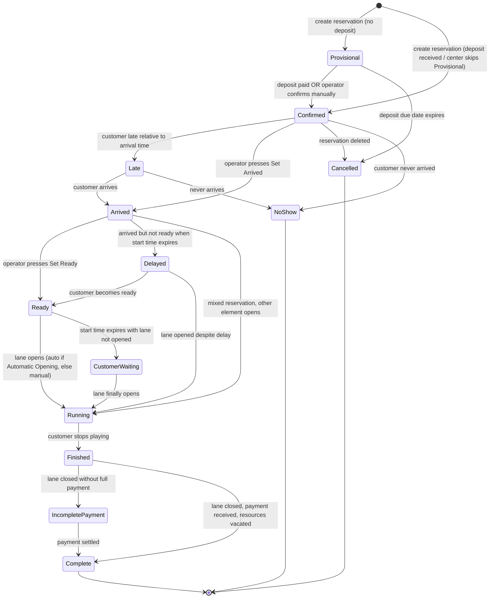

# Booking System Reference

The authoritative reservation-engine reference, mined from the official
CHM help (`Conqueror-2-364.html` through `Conqueror-2-384.html`) and
cross-referenced against the SQL schema in
[`05-database-schema.md`](05-database-schema.md).

**This is what our reservations-builder feeds into.** Every field name,
enum value, and state transition below is authoritative, verified against
what QubicaAMF ships in the English help file for v15.18.0.

## What the Booking System is

Per QubicaAMF's own words:

> "The Conqueror Booking System is a fundamental instrument for any Bowling
> Center, giving customers the option to book bowling sessions or other
> games or entertainment facilities that the Bowling Center offers, thus
> promoting business by eliminating the 'risk' element for customers who
> in the past may not have booked and arrived to find the Center
> completely full."

Integrated with **Price Keys, Discounts, Center Setup, Lane Status, and
Frequent Bowlers**. The whole booking process is designed to avoid the
operator ever leaving the Booking area, the system pulls prices,
discounts, and customer info in-context.

## The main window components

| Component | What it is |
|---|---|
| **Reservation Sheet** | Grid view, lanes down one axis, time down the other. Every booking appears as a colored rectangle. Over-booking area shown at the bottom. |
| **Control Panel** | Toolbar surrounding the sheet. Buttons for Calendar, Navigator, Zoom, Find, New Reservation, Set Arrived / Set Ready, Open/Close, Merge/Split, Customer, Reservation, Information, Cut/Copy/Paste, Modify, Delete, No Show, Color Table, Clear Customer, Print, Waiting List/Lane Status/Menu/Exit. |
| **Calendar** | Date navigator. |
| **Overbooking Area** | Where reservations that don't fit their assigned lane slot show. |

## Reservation status lifecycle

12 statuses. Each is color-coded on the Reservation Sheet for at-a-glance
triage. This is the most important thing to understand about the system.

### Status meanings (from the help file)

| Status | Meaning |
|---|---|
| **Provisional** | Booking not yet confirmed by deposit. Subject to auto- or manual cancellation after deposit due date expires. Skip this status entirely by center policy. |
| **Confirmed** | Deposit paid, OR center chose not to work with Provisional (so all bookings arrive Confirmed). Operator can also confirm manually. |
| **Late** | Customer late relative to the required arrival time (which is `start_time - arrival_lead_time`). For Time-mode bookings, "Subtract Time from Late Bookings" option can be enabled. |
| **Arrived** | Operator pressed **Set Arrived:** customer is here. |
| **Delayed** | Customer is here but not yet ready to play, and start time has expired. Operator can wait or open the lane anyway. |
| **Ready** | Customer ready to play. Operator pressed **Set Ready**. From here, if **Automatic Opening** is enabled, the lane opens on its own. |
| **Customer Waiting** | Start time expired, customer is ready, but lane never opened. Highlighted urgently, this is a bad state. |
| **Running** | Lane opened, customer bowling. In a mixed reservation, other elements auto-move to Arrived + Confirmed. |
| **Finished** | Customer stopped playing. Operator can close the lane. |
| **Incomplete Payment** | Element closed without payment. Highly visible to alert operator to non-payment risk. |
| **Complete** | Lane closed, payment received, resources vacated. Still viewable via **Modify** in Reservation Details. |
| **Cancelled** | Entire reservation deleted. Eliminated from the sheet; still queryable via report. |
| **No Show** | Customer failed to arrive. Set manually or automatically. |

### Which of these matter for our import tool

Our tool creates reservations at status **Confirmed** (via the `.xls`
import). From there:

- If Kings has enabled Provisional-status usage, our imports may need a
  deposit flag, currently we don't set one. Worth verifying at the next
  work-terminal test.
- Everything past Confirmed is driven by staff action or automatic
  time-based transitions. Our tool doesn't influence any of it.

## Fields required to create a reservation

From `Conqueror-2-370.html` "Necessary Data for New Reservation":

| Field | Description | How we set it |
|---|---|---|
| **Starting Date/Time** | Date + time of the reservation. Bounded by center opening hours unless 24-hour operation. | Rows 0-1, cols 0-1 in our .xls |
| **Customer** | Insert via card swipe, member search, or anonymous name typed in. | Row 1, col 2 (Reservation Name); no customer card link |
| **Type of Reservation** | Open, League, Parties, etc. (from dropdown). Determines color on sheet. | Not currently set, defaults to whatever ConquerorX uses when unspecified |
| **Quantities** | Number of Players, Games, Lanes, Open Mode, Open Type. | Bowler rows count = players; Row 1 col 5 = Games; body col 0 = Lane assignments; Row 1 cols 3-4 = Lane type + Opening mode |
| **Resource** | Which lane / room / table | Body row lane column |
| **Requirements** | Special needs (staff, F&B) | Not set |
| **Automatic Opening** | Auto-open lane at Ready | Not set |
| **Fast Sale** | POS pre-attach | Not set |
| **Promotional Code** | Discount code | Not set |
| **Finding the Best Price** | Auto-pick lowest applicable price | Not set |
| **Finding Free Booking Space** | Auto-find open slot | Not applicable, we specify explicit times |

## Reservation Details fields (what shows on the edit modal)

From `Conqueror-2-374.html`:

- **Customer**
- **Reservation Type:** Open / League / Parties / etc.
- **Notes**
- **Arrival Time in Advance:** how many minutes before start_time the party must arrive to avoid Late
- **Players:** bowler roster
- **Lanes:** assigned lane numbers
- **Open Type:** payment model (see below)
- **Bumpers:** 0/1
- **Sales:** associated POS sales
- **Payments:** deposits + final
- **Meals:** associated F&B
- **History and Log:** audit trail
- **Staff Requirements:** assigned staff / instructor

## Reservation types

Enumerated in the CHM as **Open, League, Parties, etc.** with center-specific
extension. Each type gets a color on the sheet. Full list requires
inspection at a specific center, the DB table `RsrvTypes` holds them.

## Advanced reservation patterns

| Pattern | Section | What it does |
|---|---|---|
| **Mixed Reservations** | `Conqueror-2-375.html` | One reservation with multiple linked elements (e.g., bowling + billiards + food). When one element goes Running, siblings auto-move to Arrived + Confirmed. |
| **Recurring Reservations** | `Conqueror-2-376.html` | Weekly / monthly repeat bookings. |
| **Reservation Confirmation** | `Conqueror-2-377.html` | Print + email confirmation to customer. |
| **Overbooking** | `Conqueror-2-367.html` | Bookings that don't fit their lane slot get pushed to the overbooking area, visual signal of allocation problems. |

## Web Reservations

`Conqueror-2-046.html` and `Conqueror-2-213.html` cover web-originated
bookings, customer-facing web reservation flow ingested by the Booking
System. Comes into the same `RsrvHdr`/`RsrvBody` tables.

## How our reservations-builder maps to this model

```mermaid
flowchart LR
    A[Tripleseat<br/>event export .csv] --> B[reservations-builder<br/>morning_import_builder.py]
    B --> C[per-event .xls files<br/>conquerorx-import-DATE/]
    C -->|manual click or AHK helper| D[ConquerorX<br/>Import Reservations dialog]
    D -->|Qbk.Reservations.Importer.dll| E[Booking System<br/>creates RsrvHdr + RsrvBody rows]
    E --> F[Reservation appears on Reservation Sheet<br/>at status Confirmed]
    F -->|operator action| G[Set Arrived → Set Ready → Running → Complete]
```

**Nothing we build touches the state machine past the initial creation.**
The tool is a data-ingest shortcut, not a workflow tool. All the color
transitions, notifications, and payment collection are driven by front-desk
staff pressing Control Panel buttons.

## Open questions specific to Booking System

- **What Reservation Types are configured at Kings?** The `.xls` template
  doesn't have a type column; ConquerorX uses whatever the venue default
  is when unspecified. If Kings needs each imported reservation labeled
  as "Party" or "Corporate Event" instead of the default, we'd need to
  add that column (Column 3 in the template maybe, not defined in the
  base template we decoded).
- **Does the Booking System auto-set Automatic Opening on imported
  reservations, or does staff have to flip it per-reservation?** Affects
  how much manual intervention remains after the import.
- **Are past imports appearing as Provisional or Confirmed?** Depends on
  whether Kings uses the Provisional/deposit workflow. If they do, our
  imports may be sitting Provisional and waiting for deposit confirmation.

## Related DB tables

From [`05-database-schema.md`](05-database-schema.md#reservations-7):

- `RsrvHdr`: reservation header (one per reservation)
- `RsrvBody`: reservation body (bowler-level rows, our body section)
- `RsrvItemDetails`
- `RsrvItemStatus`: status tracking
- `RsrvTypes`: the Type of Reservation dropdown values
- `RsrvGroups`: reservation grouping
- `RsrvContacts`: contact info
- `RsrvAgencies`: booking agencies (external partners)
- `RsrvColourDefs`: the color mapping for the sheet
- `RsrvHistory` + `RsrvHistoryLogTypes`: audit log
- `RsrvPaymentHistory` + `RsrvPaymentTypes`: payments

## Reference

- Full extracted CHM outline: [`extracted-strings/chm-en-outline.md`](extracted-strings/chm-en-outline.md#booking-system)
- Text corpus for grep: [`extracted-strings/chm-en-corpus.txt`](extracted-strings/chm-en-corpus.txt)
- Reservations import contract: [`08-templates-and-imports.md`](08-templates-and-imports.md#reservationdetailsimportxlt--the-one-we-integrate-with)
