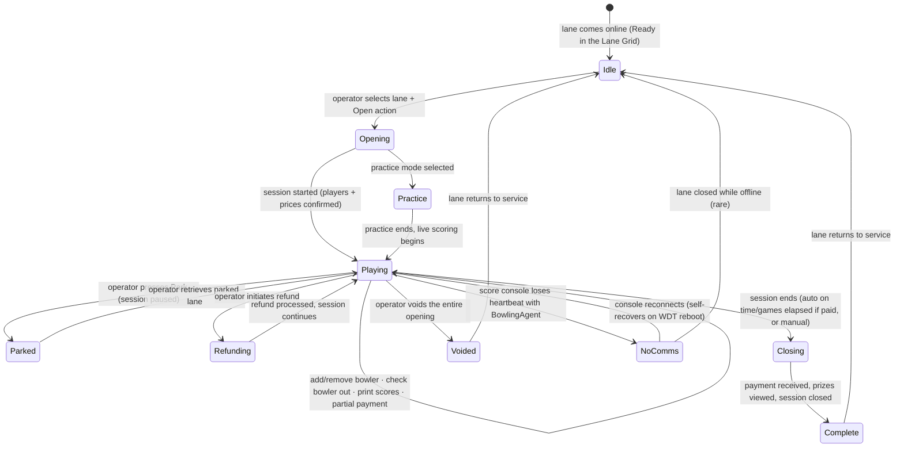

# Lane Management Reference

The lane-lifecycle authoritative reference. Extracted from CHM sections
`Conqueror-2-058.html` through `Conqueror-2-150.html` (33 sub-sections of
Lane Management), with cross-references to the SQL schema and the DLL
family map.

Kings runs `BES X - 4HD Hardware` per the setup screenshots, this doc is
scoped to that scoring generation. Older generations (BOSS, AS 80/90,
Frameworx) have their own option panels but share the same lifecycle.

## Two axes of lane behavior

Every open lane is characterized by TWO independent settings, both chosen
at open time.

### Axis 1: Opening Mode (how payment is calculated)

Per `Conqueror-2-060.html`:

| Mode | What it charges for | When Kings uses it |
|---|---|---|
| **Games** | N games per bowler. Payment linked to dynamic price keys (vary by time/day). Can also charge per-frame with proportional payment. | League play, tournaments, casual pay-per-game |
| **Time** | Charged for time on the lane. Price varies by time zone. Unlimited games during the paid window. | **Most reservations at Kings.** Our tool defaults to this (opening_mode = 2). |
| **Unlimited** | Ticket per lane OR per player (center setup choice). Bowl until ticket expires. | Special events / all-you-can-bowl promotions. Not for busy periods. |
| **Coin-op** | Legacy coin-operated hardware. | Not applicable at Kings (modern install). |

### Axis 2: Pre-assigned vs Post-assigned (when payment is collected)

Per `Conqueror-2-061.html`:

| Assignment | Payment timing | Notes |
|---|---|---|
| **Pre-assigned** | Before or during play, OR at end. Duration / game count decided upfront. Lane can auto-close when time/games elapse if paid. | Standard for reservations, Kings uses this by default. |
| **Post-assigned** | Only at end of play. Few session settings defined upfront. | For walk-ins where you don't know how long they'll play. Post-assigned time is always assigned to the LANE (not to individual players). |

## Lane lifecycle state machine

Piecing together from CHM sections 5 (Opening a Lane), 6 (Managing an Open
Lane), 7 (Closing a Lane), 8 (Parking a Lane).

## Lane Status view: what operators see

From `Conqueror-2-062.html` through `Conqueror-2-064.html`.

The **Lane Grid** is the primary front-desk view. Each lane is a tile with
icons showing:

- Occupancy state (Idle, In Session, Reserved, Parked, Out of Order)
- Score console link status (Comms OK / No Comms / Rebooting)
- Timer countdown (for Time mode) or games remaining (for Games mode)
- Payment status (Paid / Partial / Unpaid)
- Special flags (TCS active, Bumpers up, Party mode)

### Control Panel actions available from Lane Status

| Action | What it does |
|---|---|
| **Select Lanes** | Multi-lane selection for group operations |
| **Next Lane / Next Pair** | Cycle through lanes / pod-pairs |
| **Opening Modes** | Choose Games / Time / Unlimited / Coin-op for the selected lane |
| **Pinsetter** | Direct pinsetter control (full set, partial set, spot pins, cycle) |
| **Special Functions** | Mode-specific actions (BES / Bowland / Universal) |
| **Workshop** | Take lane out of service for maintenance |
| **Mechanic Service** | Call for mechanic, enters the TCS flow |
| **Shoes** | Rental shoe assignment |
| **Print Games** | Print score sheets |
| **Waiting List** | Assign next party from waiting list |
| **Transfer** | Move party from this lane to another |
| **Score** | View/edit scoresheet |
| **Options** | Bowler options (name, HDCP, gender, bumpers, hand) |
| **Modify** | Change session parameters mid-play |
| **Void** | Void the opening (as if it never happened) |
| **Park** | Pause the session (see below) |
| **Close** | End the session and collect payment |

## Opening a lane

From `Conqueror-2-066.html` through `Conqueror-2-074.html`.

Two paths:

- **Standard opening:** full wizard: number of bowlers, bowler options,
  quantities (games/time), price keys, lane options, POS items, practice
  toggle. Multiple screens.
- **Quick Opening:** shortcuts. Three variants:
  - **Open Now:** start immediately with defaults
  - **Pay Now:** collect payment at open time (guarantees paid session)
  - **Pay Later:** open now, invoice at close

For **imported reservations** (our tool's output), the operator's flow is
slightly different, see next section.

## Opening a booked lane (our tool's downstream)

From `Conqueror-2-074.html` "Opening a Booked Lane" (a subsection of
Opening a Lane).

When a reservation is at status **Ready** (customer arrived and prepared to
play), opening the lane pre-fills all reservation data into the standard
open wizard. Operator confirms and hits Open.

If **Automatic Opening** was enabled on the reservation, the lane opens
without the operator touching anything, as soon as the reservation
transitions to Ready. Our import currently does NOT set this flag, worth
adding as a config option.

**Our tool's leverage point:** the reservation data our import supplies
becomes the pre-fill for this dialog. Every field we get right saves the
operator a click.

## Managing an open lane

Available operations on a Running session, from `Conqueror-2-075.html`:

- **Adding a Bowler:** walk-up joining an existing party
- **Collecting Partial Payments:** take a card mid-session
- **Checking a Bowler Out:** one bowler leaves before session ends
- **Printing Scores:** mid-session or end
- **Voiding a Lane Opening:** as-if-never-opened cancel
- **Refunding Items:** refund a POS item back to the session

## Closing a lane

From `Conqueror-2-082.html` through `Conqueror-2-085.html`:

- **Viewing Prizes:** any prizes earned during play
- **Global Price Assignment:** apply a bulk price adjustment
- **Rounding and Combining:** round total, combine bills
- **Proportional Payment:** split bill proportionally across bowlers

## Parking a lane

From `Conqueror-2-086.html`:

A **Parked** lane preserves session state (scores, bowlers, timing) but
frees the physical lane for another use. The parked party can be
**Retrieved** later onto the same or a different lane.

Used when:
- Party wants to break for food and come back
- Center needs the physical lane for a higher-priority booking
- Lane hardware needs brief maintenance

## Group lane management

From `Conqueror-2-087.html`: managing multiple lanes as one unit.

Key concept for Kings: **the King Pin Lounge is a 4-lane group** (per
`ROOM_LANE_NUMBER_MAP` in the reservations-builder). Opened together,
priced together, scoreboard visible across all 4. Our tool distributes
bowlers across these 4 lanes at import time.

Sub-sections:
- **9.2 Group Opening:** assign players + practice setup for the group
- Assigning Players across grouped lanes
- Practice Setup across grouped lanes

## Bowler options

From `Conqueror-2-099.html`:

Per-bowler settings the operator (or bowler at the console) can change
during a session:

- **Display Name:** what shows on the score screen (our tool defaults to "Guest 1", "Guest 2", …)
- **Handicap (HDCP):** league handicap adjustment
- **Gender** (1=Male, 2=Female, no other values accepted)
- **Bumpers** (0=No, 1=Yes)
- **Hand** (0=Right, 1=Left)
- **Bowler Attribute:** free text

All of these are what our `.xls` import pre-fills. Every one is
overridable by the bowler at check-in via the score console.

## Special games available per scoring generation

Different mini-games are available per hardware family:

- **BES X Mad Games** (`Conqueror-2-288.html`), BES X exclusive novelty modes
- **BES Special Games** (`Conqueror-2-295.html`), BES generation special games (Cubes, Lucky Draw, Poker, QFlash, Slot Machine, Tic-Tac-Toe, these back the `SPG*Sessions` DB tables)
- **Bowland Special Games** (`Conqueror-2-312.html`), Bowland-hardware special games

Kings is BES X, so BES X Mad Games + BES Special Games are the applicable
sets.

## Lighting integration

- **Lights - Lane Effects** (`Conqueror-2-121.html`), per-lane
  celebration effects on strikes/spares
- **Lights - Global Moods** (`Conqueror-2-122.html`), center-wide mood
  lighting (Cosmic Bowling mode, party mode, etc.)

## Advertising per hardware family

Multiple sub-sections cover advertising because each hardware family shows
ads differently:

- Advertising - BES & Bowland (`Conqueror-2-137.html`)
- Advertising - BOSS (`Conqueror-2-138.html`)
- Advertising - Universal (`Conqueror-2-141.html`)

## Reference

- Full extracted CHM outline: [`extracted-strings/chm-en-outline.md`](extracted-strings/chm-en-outline.md#lane-management)
- DLL family map for lanes (25 DLLs): [`04-modules-and-dlls.md`](04-modules-and-dlls.md#lanes-25-dlls--the-biggest-area)
- Operations troubleshooting (No Comms pattern etc.): [`13-operations-troubleshooting.md`](13-operations-troubleshooting.md)
- Booking system (upstream of lane opening): [`14-booking-system-reference.md`](14-booking-system-reference.md)
