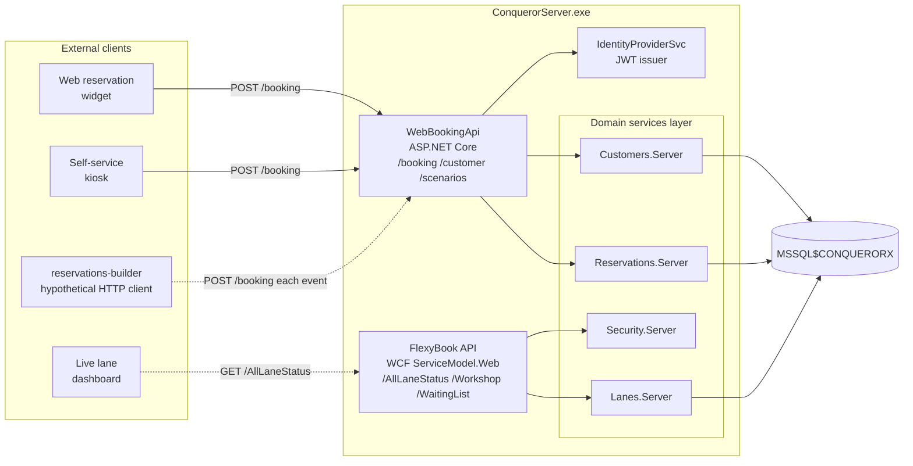

# API Surface

The REST and WCF endpoints ConquerorServer exposes. Discovered by string-scanning
the API-hosting DLLs under `C:\QDesk\Bin\ConquerorServer\`. This is the
answer to open-question **Q3**: yes, ConquerorX exposes documented API
surfaces, and yes, our reservations-builder work could theoretically move
from Excel + AutoHotkey to direct HTTP calls.

Two distinct API stacks live inside the ConquerorServer.exe process.

## WebBookingApi (Qbk.WebBookingApi.Server.dll, ASP.NET Core)

The reservation-facing REST API. Powers the "web reservations" flow
mentioned in the Booking System doc (`Conqueror-2-046.html`,
`Conqueror-2-213.html`). Same target as our `.xls` import, exposed as HTTP.

### Full route inventory

| Method (inferred) | Route | Purpose (inferred from name) |
|---|---|---|
| GET | `/lanes` | List bookable lanes |
| GET | `/resources` | List bookable resources (billiards, etc., not just lanes) |
| GET | `/openingcalendar` | Center opening calendar |
| GET | `/openinghours/bookabletimezones` | Bookable time slots per day |
| GET | `/availability?date={date}&time={time}&players={players}&games={games}&duration={duration}&totalLanes={totalLanes}&adjacent={adjacent}&resourceType={resourceType}` | Check availability for a proposed booking |
| GET | `/scenarios/categories` | Package/scenario categories |
| GET | `/scenarios?date=&time=&players=&games=&duration=&totalLanes=&category=&promotionCode=&adjacent=&resourceType=` | List package scenarios for a proposed slot |
| GET | `/scenarios/pricekeys?idscenario=&date=&time=&players=&totalLanes=&promotionCode=` | Prices for a scenario |
| GET | `/addons/addonsavailability` | Available add-ons (shoes, food, etc.) |
| GET | `/promotion/{promotioncode}` | Look up a promo code |
| POST | `/booking` | Create a new booking |
| GET | `/bookingSheet` | Fetch the reservation sheet (grid view) |
| GET | `/booking/{bookingId}` | Fetch one booking |
| PUT | `/booking/{bookingId}` | Update one booking |
| POST | `/booking/{bookingId}/customer` | Attach customer info to a booking |
| POST | `/booking/{bookingId}/notes` | Add/update notes |
| POST | `/booking/{bookingId}/cart` | Update the cart (lane charges) |
| POST | `/booking/{bookingId}/addonscart` | Update the add-ons cart |
| POST | `/booking/{bookingId}/renew` | Renew (extend) a booking |
| POST | `/booking/{bookingId}/confirm` | Confirm the booking (locks it in) |
| GET | `/customer/email/{email}` | Look up customer by email |
| GET | `/customer/checkemail/{email}` | Check whether an email exists |
| POST | `/customer/validate` | Validate customer credentials |
| POST | `/customer/resetPassword` | Password reset |
| GET | `/creditCardConfiguration` | CC processor config |
| GET/POST | `/paymentoperationid` | Payment operation id (idempotency key?) |
| GET | `/file/{fileGuid}` | File download |
| GET | `/image/{imageGuid}` | Image download |

### What this means for our reservations-builder

Our current workflow:
1. Build .xls for each event
2. Manually / via AutoHotkey walk each file through the Import Excel dialog

Could become:
1. For each event, `POST /booking` with the reservation data
2. `POST /booking/{id}/customer` to attach the customer
3. `POST /booking/{id}/notes` for the notes
4. `POST /booking/{id}/confirm` to lock it

That is one shell script or Python file per morning batch. Zero clicks, zero PDF dialogs, zero AutoHotkey. The workflow would drop from "N clicks per file" to "click Run".

The catch is authentication. See the auth section below.

## FlexyBook (Qbk.FlexyBookApi.Server.dll, WCF ServiceModel.Web)

The realtime lane-operations API. Older stack (WCF `System.ServiceModel.Web`,
which is REST-style over WCF, not ASP.NET Core). Smaller in surface than
WebBookingApi.

### Full route inventory

| Route | Purpose (inferred) |
|---|---|
| `/AllLaneStatus` | Snapshot of every lane's current state |
| `/LaneStatus/{laneNumber}` | One lane's state |
| `/PlayingLanes/{laneNumber}` | Detail on an actively-playing lane |
| `/LaneOptions` | Per-lane options (bumpers, effects, etc.) |
| `/LaneMessage/{lanes}` | Push a message to lane displays |
| `/Scores/Last/{lanes}` | Last-frame scores for one or more lanes |
| `/PinsetterCycle/{laneNumber}` | Cycle the pinsetter on a lane (mechanic action) |
| `/Workshop/{lanes}` | Set lanes to Workshop (out-of-service) mode |
| `/WaitingList` | Read the waiting list |
| `/WaitingListSetup` | Configure the waiting list |
| `/WaitingList/sms` | Send waiting-list SMS |

This is the API you would hit to build a **live lane-status dashboard**
without needing to run Conqueror.exe. Same data the front-desk lane grid
shows, exposed as HTTP.

## The rest of the server DLL surface

Ordered rough-alphabetically. All discovered under
`C:\QDesk\Bin\ConquerorServer\`. Grouped by likely function:

**API façades** (top-level HTTP entry points):
- `Qbk.WebBookingApi.Server.dll`
- `Qbk.FlexyBookApi.Server.dll`
- `Qbk.Api.dll` (small, 18 KB, likely shared plumbing)
- `Qbk.ConquerorWeb.Server.dll` / `Qbk.ConquerorWeb.dll` (main web host)

**Shared HTTP framework** (used by both APIs):
- `Qamf.Rest.AspNet.dll`, `Qamf.Rest.dll` (QubicaAMF's own REST helpers)
- `Microsoft.AspNetCore.*` (68 ASP.NET Core assemblies)
- `Microsoft.OpenApi.dll`, `Microsoft.AspNetCore.Mvc.ApiExplorer.dll` (Swagger/OpenAPI infrastructure present, meaning a `/swagger` endpoint may exist)

**Domain services** (business logic behind the APIs):
- `Qbk.Reservations.Server.dll` + `.CloudData.dll` + `.ExtendedAvailability.Server.dll`
- `Qbk.Customers.Server.dll`
- `Qbk.Lanes.Server.dll` + `.Data.Server.dll` + `.Q2A.Server.dll`
- `Qbk.Leagues.Server.dll`
- `Qbk.Tournaments.Server.dll`
- `Qbk.Shift.Server.dll`
- `Qbk.Security.Server.dll`
- `Qbk.CenterManagement.Server.dll`
- `Qbk.Economical.Server.dll` + `.CoinTech.Server.dll`
- `Qbk.MMS.Server.dll`
- `Qbk.Micros.Server.dll` (Oracle Micros POS bridge)
- `Qbk.Centralization.Server.dll` + `.History.Server.dll` (multi-center chain sync)
- `Qbk.CleanCash.Server.dll` (Swedish fiscal receipt system)
- `Qbk.CallCenter.Server.dll`
- `Qbk.DailyTask.Server.dll`
- `Qbk.UserMessages.Server.dll`
- `Qbk.FBPointSystem.Server.dll`, `Qbk.FBTSelect.Server.dll` (FBT membership + points)
- `Qbk.PoolControl.Server.dll` (billiards)
- `Qbk.InternetUpdate.Server.dll` (Working Copy update coordination)
- `Qbk.BackupServices.dll`

**"Center" microservice-style layer** (newer refactor):
- `CenterAttractionsSvc.Service.dll`
- `CenterBowlingSvc.Services.dll`
- `CenterCartSvc.Service.dll`
- `CenterCashlessSvc.Services.dll`
- `CenterCustomerSvc.Database.dll`
- `CenterEconomicalSvc.Services.dll`
- `CenterExternalPosSvc.Services.dll` (external POS integration, e.g. Micros)
- `CenterPaymentSvc.Services.dll`
- `CenterReservationSvc.Core.dll` + `.Database.dll` + `.Legacy.dll` + `.Packages.dll`
- `CenterSecuritySvc.Services.dll`
- `IdentityProviderSvc.Service.dll` (authentication issuer)
- `KnowledgeSvc.Services.dll` (knowledge base)

**Cloud + messaging:**
- `Azure.Messaging.ServiceBus.dll` (Azure Service Bus for cloud events)
- `CloudNative.CloudEvents.*` (CloudEvents spec support)
- `BlobStorageEmulatorSvc.Infrastructure.Database.dll`

## Authentication

Present but not yet fully mapped.

**Evidence:**
- `System.IdentityModel.Tokens.Jwt` referenced in `ConquerorServer.exe.config` (assembly binding redirect present, meaning JWT bearer tokens are in the picture)
- `Microsoft.AspNetCore.Authentication.*` assemblies loaded
- `Microsoft.AspNetCore.Authorization.dll` loaded
- `IdentityProviderSvc.Service.dll` exists as a dedicated identity issuer service
- `qdesk-settings/*.json` has empty `adb2cAuth: {}` and `oidcAuth: {}` blocks reserved

**Best current interpretation:**
- FlexyBook (WCF) probably uses NTLM/Windows auth or a shared secret in the URL or header, given its older ServiceModel.Web stack
- WebBookingApi likely uses **JWT bearer tokens** issued by `IdentityProviderSvc`
- Cloud-oriented flows (customer signup, cross-center) probably use Azure AD B2C (`adb2cAuth`), currently unconfigured on our local install

**What we do not know yet:**
- The exact token endpoint (`/token`? `/oauth2/token`? `/api/auth`?)
- Whether there are per-center-issued API keys we could get from QubicaAMF
- Whether the auth is enforced at all on a locally-installed developer instance (some setups leave it open behind localhost)

## Port bindings

The ports we saw earlier (8018, 8048, 8084) were bound by
ConquerorServer.exe at the time of our snapshot. The DLLs do not hard-code
these numbers, meaning port assignment is either:

1. In a config file we have not read yet (candidate: a Kestrel startup
   snippet inside `Qbk.ConquerorWeb.Server.dll` that reads from
   `Options` or `QParam` DB table at startup)
2. Or pulled from the SQL Server `QParam` / `Globals` tables at boot

Which port maps to which API (WebBookingApi on 8018? FlexyBook on 8048?
Static SPA on 8084?) needs a live probe against a running instance.

## API composition (Mermaid)



## For our tooling: the migration path

The current `.xls` + AutoHotkey workflow could be replaced by an HTTP
client. Rough plan:

1. **First live probe.** Start ConquerorServer.exe on the test box, then
   `curl http://localhost:8018/swagger` (and 8048, 8084) to find whether
   OpenAPI docs are exposed. If they are, we have full request/response
   schemas without guessing.
2. **Auth handshake.** Figure out how JWT tokens are issued. Likely
   `POST /token` or a similar endpoint on the IdentityProviderSvc.
3. **Prototype.** Reproduce one Tripleseat-derived reservation as a
   `POST /booking` call and see if it lands correctly. If it does, the
   Excel format becomes optional.
4. **Fallback.** Keep the Excel path as the ground-truth import method
   for centers where the API is not reachable or auth is not configured.

This is a multi-session effort, not a next-hour thing. Documenting the
surface now so we can act on it when we have terminal time.

## Live-probe attempt on 2026-08-25

Tried to start the `ConquerorServer` Windows service to hit the endpoints
directly. Blocked at `Start-Service`: the service ACL requires an
elevated shell to control it, and we ran from a non-elevated WSL bridge.

To finish the live probe, run this from an elevated PowerShell on the
Windows side (right-click PowerShell, Run as Administrator):

```powershell
Start-Service ConquerorServer
Start-Sleep -Seconds 30
Get-NetTCPConnection -State Listen | Where-Object { $_.LocalPort -in 8018,8048,8084,8760 } | Format-Table LocalPort,OwningProcess
```

Then probe each candidate port:

```powershell
Invoke-WebRequest http://localhost:8018/swagger -UseBasicParsing
Invoke-WebRequest http://localhost:8048/swagger -UseBasicParsing
Invoke-WebRequest http://localhost:8084/swagger -UseBasicParsing
```

A 200 with an OpenAPI JSON confirms the port and gives the full
authoritative schema for every route. Any 401/403 is also useful (tells
us auth is enforced and where). A 404 or connection refused means
that port hosts something else.

## What we did NOT do here

- **No live probe completed.** ConquerorServer service failed to start
  from our non-elevated shell (see above); needs Run-as-Administrator.
- **No DLL decompilation.** ILSpy on `Qbk.WebBookingApi.Server.dll` would
  give us controller-attribute-level ground truth (`[HttpPost]`,
  `[Route("...")]`, `[Authorize]`), which would replace all "(inferred)"
  labels with facts. Left for a future pass.
- **No exercise of any endpoint.** Every route listed is documented, not
  called.

## Reference

- Extensibility notes (RoutingDefs plugins, other seams): [`09-extensibility.md`](09-extensibility.md)
- Network + IPC context: [`07-network-and-api.md`](07-network-and-api.md)
- Auth-related config keys: [`06-configuration.md`](06-configuration.md)
