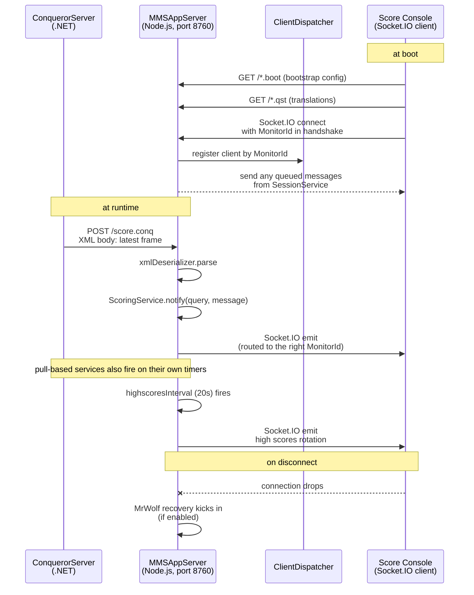

# MMS Realtime Server

The MultiMedia System (MMS) real-time layer. Node.js server bundled inside
`C:\QDesk\Bin\ConquerorServer\MMSAppServer\`. Answers open-question **Q4**:
what does the MMS Socket.IO layer on port 8760 do, and can it power a
live lane-status dashboard.

Short answer: yes. It is the fan-out layer that gets score updates, waiting
list changes, and marketing content down to every lane console / monitor in
the center in real time. Static source analysis; no live probe.

## Architecture in one paragraph

ConquerorServer (the .NET side) POSTs XML messages to MMSAppServer over
HTTP. MMSAppServer parses them, updates its in-memory service state, and
pushes changes down to connected clients over Socket.IO. Clients are lane
score consoles, digital signage monitors, and anything else that
identifies itself with a `MonitorId` on connect. The port is bound
via a command-line arg at startup (production is `8760`).

## Startup and hosting

Entry: `runserver.cmd` → `runserver.js` → `lib/server/server.js`.

The HTTP server listens on `args.port` (production `8760`, from the earlier
port scan) and the Socket.IO server rides on top of the same HTTP server.
Config values come in via `server.config` (poll intervals, log level) plus
command-line args parsed by `arguments_parser.js`.

## Request dispatcher: 10 URL suffix patterns

`RequestDispatcher` routes every incoming HTTP request to one of these
handlers based on the URL suffix. This is the HTTP surface of the MMS
server:

| URL suffix | Handler | Purpose |
|---|---|---|
| `.*` (fallback) | `StaticServer` (node-static) | Serves static assets from the root dir |
| `.conq` | `ConquerorListener` | XML message push from ConquerorServer (the north-bound feed) |
| `.adv` | `AdvertisingMediaServer` | Advertising asset delivery |
| `.modulr` | `ModulrServer` | Modulr module bundling for client JS |
| `.score` | `ScoringImageServer` | Score image rendering |
| `.log` | `LoggingServer` | Log ingest from clients |
| `.boot` | `BootServer` | Client boot / config bootstrap |
| `.logo` | `LogoImageServer` | Center logo image serving |
| `.media` | `AdvertisingSetupServer` | Advertising setup |
| `.qst` | `TranslatorServer` | Translations delivery |

## ConquerorServer → MMS: the 10 service channels

ConquerorServer POSTs XML to `/{service-id}.conq` on the MMS server.
`ConquerorListener` parses the XML and hands it to the matching service.
The 10 registered service ids:

| Service id | Service class | What flows through |
|---|---|---|
| `status.conq` | `StatusService` | Overall status broadcasts |
| `session.conq` | `SessionService` | Session lifecycle (which "experience" is on which monitor) |
| `bestscores.conq` | `BestScoresService` | Best-scores updates |
| `waitinglist.conq` | `WaitingListService` | Waiting-list changes (polled at `waitingListInterval`) |
| `pricelist.conq` | `PriceListService` | Price list updates (polled at `priceListInterval`) |
| `score.conq` | `ScoringService` | Live scoring frame-by-frame |
| `standings.conq` | `StandingsService` | League standings (polled at `standingsInterval`) |
| `strikechallenge.conq` | `StrikeChallengeService` | StrikeChallenge mini-game state (8-second timeout) |
| `experience.conq` | `ExperienceService` | "Experience" packages (bundled promos) |
| `highscores.conq` | `HighScoresService` | High-scores rotation (polled at `highscoresInterval`, default 20s) |

Wire format is XML, deserialized by `xml_deserializer.js`. Reply body is
optional. `xml2js` is bundled in `node_modules`.

## Client → MMS: the Socket.IO channel

Clients connect via Socket.IO (the `socket.io` bundled version is 0.9-era,
old but stable). Handshake requires a `MonitorId` query parameter in the
format `<mac>-<monitor>` (device MAC + monitor number). The dispatcher
uses that to route service messages to the right physical monitor.

Client events observed in the source:

| Event | Direction | Meaning |
|---|---|---|
| `connection` | server-side | New client attaches; ClientInfo decoded from handshake |
| `disconnect` | server-side | Client dropped; recovery may kick in |
| `message` | client → server | Client sends a message. Special value `'stop'` disables recovery for that client |

Recovery is opt-in via `args.recoveryEnabled`. The recovery helper is
literally named `MrWolf` (a Pulp Fiction reference) and "solves the
problem" by triggering some remediation flow when a client drops
unexpectedly.

## Services layered on top

Each of the 10 services is instantiated at server startup with an
associated **session factory**, which produces per-monitor session objects
when a client connects. The factories are stitched together in a
composite `SessionFactory` that dispatches based on the experience type
currently assigned to the monitor:

- Advertising, Standings, BestScores, Scoring, PriceList, WaitingList,
  Video, Off, StrikeChallenge, Experience, HighScores

`SessionService` orchestrates which factory handles which monitor at any
moment. `CurrentSessionNotifier` sequences transitions between sessions
with a configurable `sequenceDelay`.

## Message flow (Mermaid)

## Configurable knobs

From `server.config`:

- `experienceIntervals.static` (default 10000 ms) — how often static content refreshes
- `experienceIntervals.video` (default 6000 ms) — video refresh
- `highscoresInterval` (default 20000 ms) — high-scores rotation

From command-line args (`arguments_parser.js`):

- `port` — HTTP + Socket.IO port (production `8760`)
- `datafolder` — where the server keeps logs, advertising, translations
- `root` — static file root
- `loglevel` — log verbosity
- `recoveryEnabled` — turns MrWolf on / off
- `websocketHeartbeatTimeout` (default 15) — Socket.IO heartbeat timeout
- `websocketHeartbeatInterval` (default 20) — Socket.IO heartbeat interval
- `waitingListInterval`, `standingsInterval`, `scoringInterval`,
  `scoringPlayerInterval`, `priceListInterval`, `strikeChallengeInterval` —
  per-service poll intervals
- `mediaNotFoundWaitingTime` — how long to wait before giving up on a
  missing advertising asset
- `sequenceDelay` — delay between session transitions
- `experienceVideoBaseUri` — base URI for hosted experience videos

## Logging

`log_manager.js` wraps log4js. Configuration at
`lib/server/log4js_mms.json`:

- File appender: `./data/logs/mms.log`, rotates at 2 MB, keeps 100
  backups
- Console appender: colored pattern

Loglevel comes from the args (production is `TRACE` per the shipped
`server.config`, which is chatty).

## For our tooling: what a lane dashboard would look like

The Socket.IO channel is the easiest path to a live lane-status dashboard.
Rough sketch:

1. Node.js or Python client using `socket.io-client` (the same version
   MMS bundles).
2. Connect to `http://<server>:8760/socket.io/?MonitorId=<fake-mac>-<n>`
3. Listen for `message` events and log or render them.

Whether an unregistered client gets meaningful data depends on how the
`DeviceDecoder` and `SessionService` treat unknown MonitorIds. Safe bet:
the server will accept the connection and send a default "Off" session.
To get real lane data, we would need a MonitorId that Conqueror considers
a valid monitor.

**Better path** — instead of impersonating a client, do a passive tap on
the northbound side. Every `.conq` HTTP POST from ConquerorServer is an
XML message describing an event. Point a small proxy at MMS's port 8760
and log the POST bodies to file. That gives us the full realtime feed
with zero risk of confusing the actual monitors.

## What we did NOT do

- **No live connection.** MMS was not running during this pass.
- **No mock monitor registration.** Untested whether the server accepts
  unknown MonitorIds.
- **No packet capture of a live `.conq` feed.** That would give us
  ground-truth XML schemas, which are undocumented.

## Reference

- Q4 in [`12-open-questions.md`](12-open-questions.md)
- Broader network + port map: [`07-network-and-api.md`](07-network-and-api.md)
- Sibling API surface (WebBookingApi + FlexyBook): [`17-api-surface.md`](17-api-surface.md)
- Earlier MMS notes (inventory only): [`inventories/15-mmsappserver-and-plugins.txt`](inventories/15-mmsappserver-and-plugins.txt)
