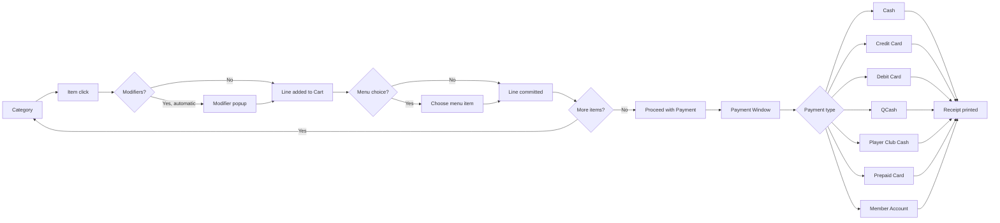

# Point of Sale Reference

The POS module handles every transaction in the center: bar sales,
pro-shop retail, deposits, refunds, tips, and lane time. Extracted from
CHM sections `Conqueror-2-025.html` through `Conqueror-2-057.html`
(12 top-level sub-sections). Cross-referenced against the SQL schema
under Receipts, Transactions, Bills, and PaymentTypes.

## What POS is, in one paragraph

POS is a shared module accessible from four places: the Main Menu, Lane
Control, the Booking System, and Lockers. The layout stays consistent
regardless of entry point; only the pre-loaded context (what items are
ready to sell) changes. Every payment in the center flows through it,
which is why the module composes with almost every other domain
(reservations, F+B, prepaid cards, loyalty, credit-card processors).

## Main-menu entry points

From `Conqueror-2-026.html`:

| Entry | What it lets an operator do |
|---|---|
| **Income** | Retail sales across categories (Snack Bar, Pro Shop, bowling games, etc.) |
| **Tabs** | Multi-transaction tabs, kept open across a session |
| **Expenses** | Pay a supplier from the cash register |
| **Deposits** | Take, hold, and release deposits |
| **Refunds** | Correct sales errors, refund deposits |
| **Tips** | Enter gratuities separately from sales |
| **Reprint Receipts** | Reprint after loss or printer failure |
| **Open Cash Register** | No-sale drawer open |

## Selling flow (Mermaid)

## Sale operations available on any transaction

From `Conqueror-2-028.html`:

- **Multi-quantity sales** — click item N times, or press a numeric key then the item
- **Modifiers** — options attached to a price key (size, temperature, etc.). Automatic vs Optional
- **Menu choices** — pick a specific item from a package (which soda in a combo)
- **Notes** — free text under a line
- **Delete row** — remove an item from the cart
- **Void a price key** — full-price-key void with tracked reason
- **Discount** — apply a discount to a line or the whole cart
- **Clear bill** — wipe the cart before payment
- **Assign to member** — link the transaction to an FBT member for points/tracking
- **Add a tip** — enter gratuity
- **Create/save/manage tabs** — open a tab, save items to it, retrieve later
- **Proceed with Payment** — open the payment window
- **Undo payment + reprint** — restricted, tracked

## Tabs

From `Conqueror-2-032.html`. Tabs are one of the busiest POS constructs.

| Tab lifecycle | Notes |
|---|---|
| **Create manually** | Operator opens a tab, names it |
| **Auto-create** | Some flows (reservation arrival, lane opening) auto-open a tab |
| **Incoming Reservation Tabs** | Reservation-linked tabs appear when a party arrives |
| **Sort** | Sort tabs on the tab list |
| **Merge** | Combine two tabs into one |
| **Delete** | Remove a tab |
| **Credit Card + Seamless Transactions** | CC info can be pre-authed on the tab |
| **Print bill** | Print the running total for review |

## Gratuities and tips

From `Conqueror-2-033.html`:

- **Automatic Gratuities** — auto-apply gratuity on parties over N people
- **Collecting a Payment** — gratuity flows during payment
- Reported separately in Shift Reports

## Payment types

The full menu, from `Conqueror-2-034.html` and `Conqueror-2-035.html`:

- Cash
- Credit Card
- Debit Card
- QCash (FBT prepaid balance)
- Player Club Cash
- Prepaid Credit Card
- Member Account

Special flows:
- **Paying Separately** (`Conqueror-2-036.html`) — split by bowler
- **Dividing the Bill in Equal Portions** (`Conqueror-2-037.html`) — even split
- **Reprinting Receipts** (`Conqueror-2-038.html`)
- **Undoing Payments** (`Conqueror-2-039.html`) — with documented restrictions
- **Open the Cash Drawer** (`Conqueror-2-040.html`) — no-sale drawer open

## Expenses, Deposits, Refunds

Three side flows off the main POS surface:

- **Expenses** (`Conqueror-2-041.html`) — pay a supplier, tracked as expense category
- **Deposits** (`Conqueror-2-042.html`) — take a deposit against a future reservation; deposits transition from held to consumed when the reservation runs
- **Refunds** (`Conqueror-2-043.html`) — return money to a customer; tracked with reason

## Tax exemption

From `Conqueror-2-044.html` through `Conqueror-2-048.html`. Full support for
tax-exempt customers (e.g. nonprofits, government):

- Payment modes for tax-exempt (5 sub-modes)
- Tax-exempt ID linked to FBT member
- Reservation and web reservation flows
- Reporting: summary in shift, grouped by tax exemption, historical
- Exports to Dassle (QCAD, Swedish fiscal system) and QuickBooks Desktop

## Credit card processing

From `Conqueror-2-049.html` through `Conqueror-2-053.html`.

Providers supported (from sub-section titles):

- **PAYwareConnect** (Verifone), **PAYwarePC**, **PCCharge** (local providers)
- Plus web-based providers via Provider Setup

Batch summary view lets managers reconcile CC batches. Void and refund
per transaction with audit trail.

## POS Setup

From `Conqueror-2-054.html` onward. Configures:

- Cash drawer + printer routing
- Category setup
- Price keys (items with prices)
- Modifiers
- Menu choices
- Kitchen printer routing (F+B orders to kitchen)
- Tab defaults
- Prompts for tips
- Rounding rules

## Related SQL tables

From [`05-database-schema.md`](05-database-schema.md):

- `Bills` — issued bills
- `Receipts` + `ReceiptsRows` + `ReceiptsPaymentRows` + `ReceiptsTaxRows` + `ReceiptsPointsRows` — receipt detail
- `Transactions` + `TransactionsRows` + `TransactionsStack` + `TransSubRows` — transaction ledger
- `PaymentTypes` — the payment-mode dropdown values
- `PriceKeys` + `PriceTime` — items + time-based pricing
- `BarGroups` + `BarItems` + `BarOrders` + `BarOrdersItems` + `PackageItems` — F+B side
- `MicroSaleSettings` + `MicroSaleTransactions` — Micros POS integration
- `CreditCardHistory` + `CreditCardTransaction` — CC processing
- `PointsCollection` — loyalty points earned

## Related Crystal Reports

From [`15-reports-catalog.md`](15-reports-catalog.md), POS-adjacent
templates:

- `BILLS.rpt`
- `EndOfShiftCashOut.rpt`
- `EndOfShiftCashOutBillsAndCoins.rpt`
- `CoinHopper.rpt`
- `CoinOperated.rpt`
- `CreditCard.rpt`, `HistoricalCreditCard.rpt`, `HistoricalCreditCardTotals.rpt`
- `DarReport.rpt` (Daily Activity Report)
- `HourlySales.rpt`, `HourlySalesTotals.rpt`
- `Invoice.rpt`
- `MainDept.rpt` (largest report at 278 KB)
- `NetTotalIncome.rpt`
- `TaxExemption.rpt`, `TAXINC.rpt`, `TAXNTINC.rpt`
- `Tips.rpt`
- `TransactionsList.rpt`
- `TrustMoneyRpt.rpt`, `TrustMoneyMiscRpt.rpt`
- `Void.rpt`

## Integrations that touch POS

From [`10-integrations.md`](10-integrations.md):

- **Micros POS** (Oracle) — bidirectional XML bridge for kitchen/bar orders
- **Square** via `SquareReceiptPlugin` in RoutingDefs
- **QuickBooks Desktop** — export of tax-exempt transactions
- **PAYwareConnect / PAYwarePC / PCCharge** — CC processor gateways
- **Bixolon SRP-210** — receipt printers
- **CleanCash / Dassle (QCAD)** — Swedish fiscal receipt system

## Reference

- Overview and lane opening (POS enters here too): [`16-lane-management.md`](16-lane-management.md)
- Booking System (POS attaches to reservations): [`14-booking-system-reference.md`](14-booking-system-reference.md)
- FBT and QCash: [`21-fbt-membership.md`](21-fbt-membership.md)
- Reports catalog: [`15-reports-catalog.md`](15-reports-catalog.md)
- CHM outline anchor: [`extracted-strings/chm-en-outline.md`](extracted-strings/chm-en-outline.md#point-of-sale)
