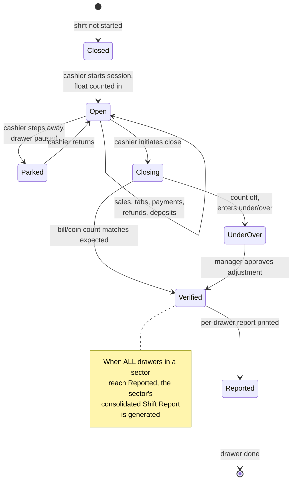

# Shift Management Reference

Employee work-session tracking. From CHM sections `Conqueror-2-155.html`
through `Conqueror-2-175.html` (9 sub-sections). Covers cash-drawer
management, shift reporting, personal cash drawers, and the reporting
exports (QuickBooks, Dassle/QCAD).

Kings runs Shift Management, since it has multiple staff working
distinct sectors (front desk, bar, kitchen, mechanics). This is the
system that produces the shift-end DAR report managers close out on.

## Key concepts (from `Conqueror-2-157.html`)

### Sector

The center is organized into named sectors: bowling, restaurant,
pro-shop, lockers, etc. Each sector can run its own hours and its own
shift schedule. Sectors are defined in Center Setup.

### Shift

The period between opening and closing all cash drawers in one sector.
Every transaction any cashier makes in that window rolls into one
consolidated **Shift Report**.

### Cash Drawer Session

One or more cashiers working the same cash drawer during a shift. A
sector can have multiple cash drawers, and each drawer can be shared by
multiple terminals. Example from the CHM: restaurant bar drawer shared
by two terminals, pizza area drawer accessed by a separate terminal.

### Reports

Two layers stack:

1. Per-drawer reports at drawer closure
2. Sector-level **Shift Report** consolidating all its drawers

Both go to the manager for verification. Non-shift centers get a single
**Daily Report** instead.

### Shift Progression

Sequential lifecycle of a shift, from first drawer open to Shift Report
signoff.

### Magic Number

A calculated tie-out number in the shift-management context used to
verify a shift closed cleanly. Also appears in league standings math
via `MagicNumber.rpt` (different meaning there).

## Two operating modes

From `Conqueror-2-158.html`.

| Mode | Suited for | Reports |
|---|---|---|
| **Shift mode** | Any center with multiple staff / sectors | Cash-drawer report per closure + Shift Report per sector-shift |
| **No Shift mode** | Small family-run centers | Daily Report (with Print + Reset lifecycle) |

Kings uses **Shift mode**.

## Cash drawer lifecycle (Mermaid)

## Personal cash drawer variant

From `Conqueror-2-165.html` through `Conqueror-2-167.html`.

Each cashier gets a personal drawer that follows them from terminal to
terminal:

- Logging off from a terminal locks the personal drawer
- Managing shifts across terminals still consolidates to one report per person
- Requires drawer hardware, configured printer profiles, and cashier privilege setup

Configured via Conqueror Pro Settings pages, not the standard back
office.

## Shift Report configuration

From `Conqueror-2-168.html`. Every shift report has selectable output
config:

| Setting | What it controls |
|---|---|
| **Detail Level** | Summary vs full transaction list |
| **To be Printed on Receipt Printer** | Route to receipt printer (compact) vs full printer |
| **Group Type** | How rows are grouped (by category, by cashier, by hour) |
| **Price Information** | Include prices or just counts |
| **Optional Information** | Weather, notes, staff assignments |
| **Export** | File export |
| **E-mail** | Send report via email |
| **Print** | Standard print |
| **Preview** | On-screen preview |
| **QuCad/Zonal** | Export to QuCad (Swedish fiscal) / Zonal POS |
| **QuickBooks Desktop** | Export to QuickBooks |

## Managing shifts after the fact

From `Conqueror-2-169.html`. Manager tools:

- **Report:** re-run report for a past shift
- **Delete Shift:** remove a shift record (audit-tracked)
- **Transfer History:** move transactions between shifts
- **Ordered by:** sort filter
- **Magic Number:** verify shift closed cleanly
- **Filters:** search across shift history

## Historical reports

`Conqueror-2-170.html`. Aggregate reports across shifts. Includes a
dedicated **Fiscal Requirements for the German Market** section, which
means ConquerorX has built-in support for German fiscal-audit rules
(GoBD, TSE / Kassensicherungsverordnung). Not relevant to Kings (US),
but shows the platform is deeply internationalized.

## Profiles and Privileges

From `Conqueror-2-171.html` and `Conqueror-2-172.html`.

Shift management ties directly to the security system. Each staff role
has a profile with a set of privileges. Common privilege examples for a
Kings-like center:

- **Cashier:** open drawer, take payment, print own shift report
- **Bartender:** cashier + bar-specific F+B ops
- **Front Desk Lead:** cashier + reservation edit + lane control
- **Manager:** all cashier ops + close shifts + delete shift + view all reports + manage users
- **Mechanic:** TCS acknowledge + lane workshop + no cash

Full privilege catalog is per-center; SQL tables `AccessRights`,
`Profiles`, `UserProfiles`, `Staff` hold the model.

## Shift Setup (per-center config)

From `Conqueror-2-173.html`. Center-wide shift knobs:

- **Shifts:** number and schedule
- **Personal Cash Drawer:** enable / disable
- **Count Float on Closure:** require cashier to count float
- **Bill and Coin Details:** require denomination breakdown
- **Stricter Under/over Management:** require manager approval for any discrepancy
- **Notes, Weather and Staff:** additional shift-report fields
- **Float Confirmation:** require confirm on float count
- **Shift Report Signing Section:** printed signature line
- **Automatic Shift Closure:** auto-close at end-of-day
- **Print Function:** printer routing
- **Automatic Export:** auto-fire QuickBooks / Dassle export
- **Tax Exemption Suffix:** suffix on tax-exempt line
- **QuickBooks Desktop:** QB export config
- **Reset Shift Report Number:** reset the sequential shift number
- **Backtask Sector:** which sector runs background tasks
- **Send Report:** auto-send via email
- **Shift Zone:** time zone for shift boundaries

## Sector Setup

From `Conqueror-2-174.html`. Per-sector config:

- Sector name, hours, active drawers
- **Exclusive Responsibility of Cash Drawers:** lock a drawer to one
  cashier per session (vs shared)

## QuickBooks Desktop Account Settings

From `Conqueror-2-175.html`. Maps ConquerorX payment modes to
QuickBooks accounts for automatic export at shift close. Kings does not
currently run QuickBooks Desktop (see market context research), but
the wiring is present if it ever gets adopted.

## Related SQL tables

From [`05-database-schema.md`](05-database-schema.md):

- `Shifts`: shift definitions
- `ShiftOperators`: cashiers per shift
- `ShiftTimeZones`: shift time-zone boundaries
- `CashStatus`, `CashTurns`, `CashTurnOperators`: cash-drawer sessions
- `Staff` + `StaffLog` + `StaffSectors`: staff roster + audit
- `Sectors`: sector definitions
- `Departments`: department mapping
- `AccessRights` + `Profiles` + `UserProfiles`: security model

## Related Crystal Reports

From [`15-reports-catalog.md`](15-reports-catalog.md):

- `EndOfShiftCashOut.rpt`: the primary shift-close report
- `EndOfShiftCashOutBillsAndCoins.rpt`: denomination breakdown variant
- `DarReport.rpt`: Daily Activity Report (No-Shift mode)
- `UnderOverNotes.rpt`: cash discrepancies
- `IndividualTimeTracking.rpt`: per-staff time
- `GlobalTimeTracking.rpt`: all-staff aggregate
- Historical variants for each

## Related integrations

- **QuickBooks Desktop:** chart-of-accounts export
- **Dassle / QCAD:** Swedish fiscal receipt exports
- **Zonal / QuCad:** POS exports
- **CleanCash:** Swedish fiscal-compliance service (bundled DLL)

## Reference

- Security + profile model detail: [`06-configuration.md`](06-configuration.md)
- POS handles the transactions that roll into shifts: [`19-point-of-sale.md`](19-point-of-sale.md)
- FBT points earn during shift transactions: [`21-fbt-membership.md`](21-fbt-membership.md)
- CHM outline anchor: [`extracted-strings/chm-en-outline.md`](extracted-strings/chm-en-outline.md#shift-management)
