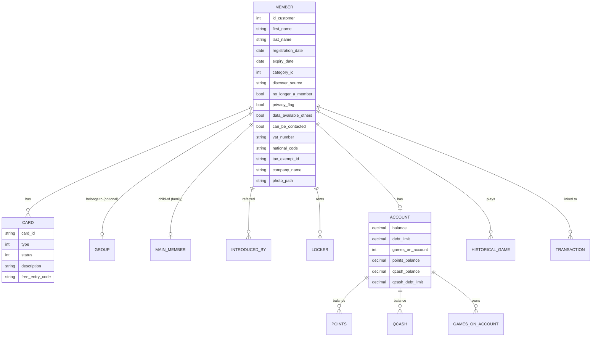
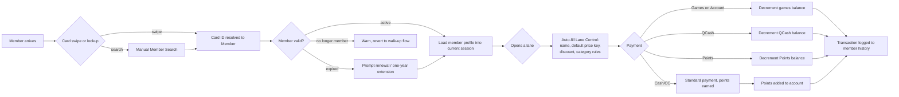

# Frequent Bowler Tracking (FBT) Reference

Membership + loyalty module. From CHM sections `Conqueror-2-176.html`
through `Conqueror-2-208.html` (12 sub-sections). This is where the
customer database lives: member records, membership cards, points,
QCash prepaid balance, invoicing, mail merge, and duplicate
detection.

FBT is the full name QubicaAMF gives to what everyone else calls a
"loyalty program". Confirms glossary Q11.

## What FBT does (from `Conqueror-2-177.html`)

Custom member database that tracks every transaction a member makes,
enabling:

- Personalized special offers based on visit habits
- Score-based classifications
- Group-membership pricing (companies, teams, clubs)
- Exclusive price keys + discounts per member category
- Locker rental
- Marketing mail merge + point collection

On lane opening, swiping a member card:

- Auto-fills the member's name in Lane Control
- Applies member default price keys + discounts
- Enables charge-to-account (QCash) instead of cash/card at the desk

A member can hold multiple cards, and non-member cards (credit cards,
external loyalty cards) can be aliased to a membership record for the
same auto-lookup behavior.

## Member data model (Mermaid)

## Member record structure

From the "Registering a New Member" sections (`Conqueror-2-180.html`
through `Conqueror-2-187.html`), a member record has seven tabbed
sections:

| Tab | Content |
|---|---|
| **Basic** | Name, contact, group affiliation |
| **Advanced** | Registration + expiry dates, one-year extension, discover source, VAT number, national code, free-entry code, tax-exempt ID, company name, privacy flags, statistics opt-in, notes, No Longer a Member toggle |
| **Links** | Main Member (family grouping), Introduced by, Destination of Statistics, Destination of Points, Locker Link, Main Contact, Active Contact, Other Member Links |
| **Account** | Category, Owns an Account, Games on Account, Refund Games, Points in Account, Use Points, QCash in Account, Refund QCash, QCash Debt Limit, Account Balance, Account Debt Limit |
| **Cards** | Card type, status, description, free-entry code, notes. Multiple cards per member. |
| **Photo** | Member photo (for identity verification) |
| **History** | Full activity history |

Notable fields for our tooling (if we ever look up existing members
during an import):
- **VAT Number**, **National Code**, **Tax-exempt ID** for business
  customers
- **Company Name:** group bookings key off this
- **Category:** which member category (drives default pricing)
- **Card ID:** swipe lookup value

## Three currency-like balances on an FBT account

FBT accounts carry three separate balances:

| Balance | What it represents | How it earns / spends |
|---|---|---|
| **Games on Account** | Prepaid game count | Earn by prepaying, spend by opening a lane on member's account |
| **Points** | Loyalty points | Earn on qualifying transactions (see Point Collection setup), spend on member-only rewards |
| **QCash** | Prepaid cash-equivalent balance | Recharge with real cash/card at POS, spend as a payment mode |

Plus a fourth: **Account Balance / Account Debt Limit:** for members
allowed to run a running balance (Kings-style corporate accounts).

## FBT operations

From `Conqueror-2-178.html` through `Conqueror-2-179.html`:

- **New Member / New Group:** add member record + assign card(s) +
  take photo
- **Modify:** update member record
- **Info:** quick view (photo + card + games credit + expiry + default
  price keys + contact)
- **Search:** lookup by any field
- **Clear:** clear the current tab view

## FBT flow when a member arrives (Mermaid)

## Duplicated Members

`Conqueror-2-198.html`. Duplicate detection + merge:

- **Identifying Duplicated Members:** matches on name / email / phone
  / card
- **Comparing and Merging Two Members:** side-by-side, pick which
  fields survive, merge history + balances

Backed by `qsp_homonymous_customers`, `qsp_merge_customers`,
`qsp_replace_customer` stored procs and `Qbk.Customers.Homonymous.dll`.

## Exporting / Importing FB Data

`Conqueror-2-199.html`. Bulk operations:

- **Export:** CSV or Excel of the member roster + selected fields
- **Import:** batch add / update via templates. This is where
  `Members.xlt` and `Members with ID.xlt` (in `C:\QDesk\Bin\xlt\`)
  come in

Also supports BowlerTrac XML and OVR DBF legacy imports. See
[`08-templates-and-imports.md`](08-templates-and-imports.md) for the
template shape and [`10-integrations.md`](10-integrations.md) for
BowlerTrac / OVR context.

## Mail Merge

`Conqueror-2-195.html` through `Conqueror-2-197.html`. Built-in mail
merge for member marketing:

- **Creating Mail:** build a targeted list, apply filters
- **Templates:** Word / Excel templates for letters and labels
- **Print:** letters + address labels

Modernized version of this is presumably the QCloud-side marketing
kits + cross-center loyalty (see [`10-integrations.md`](10-integrations.md)).

## Historical Games

`Conqueror-2-200.html`. Manage historical game records attached to
members:

- Filter games
- Add a new game manually (recovery from data loss)
- Change eligibility (which league counts toward standings)
- Modify or delete a game (audit-tracked)

## Member Setup (per-center config)

From `Conqueror-2-201.html` through `Conqueror-2-207.html`:

| Setup section | What it configures |
|---|---|
| **Member Categories** (`2-202`) | Category definitions with associated pricing / discount rules |
| **Point Collection** (`2-203`) | Rules for how points are earned per transaction type |
| **Player Club Cash** (`2-204`) | Player Club Cash mechanic (a specific payment mode) |
| **Promotions** (`2-205`) | Promotional pricing rules for members |
| **Member Formats** (`2-206`) | Card number formats, ID validation |
| **Mandatory Fields** (`2-207`) | Which fields must be filled on new-member creation |

## Reporting

From `Conqueror-2-192.html`:

- **Basic filters:** active/inactive, category, date range, VIP
- **Advanced filters:** behavioral (games played, visits, spend
  threshold, birthday range)
- **Reporting:** export filtered lists for analysis / mail merge / CRM
  push

Related Crystal Reports (from [`15-reports-catalog.md`](15-reports-catalog.md)):
`FBTCR.rpt`, `FBTGIR.rpt`, `FBTGR.rpt`, `FBTLR.rpt`, `FBTSCR.rpt`,
`FBTSIR.rpt`, `FBTSMVER.rpt`, `FBTTLR.rpt`, `FBTTR.rpt`,
`FBTPointsBalance.rpt`, `BowlersAndGames.rpt`, `CenterAvg.rpt`,
`BestPlayerDetails.rpt`, `BestGamesSupReport.rpt`.

## Related SQL tables

From [`05-database-schema.md`](05-database-schema.md):

- `Members`: the member roster (with triggers `Members_ITrig` +
  `Members_UTrig`)
- `FamilyContacts`: family contact links
- `Titles`: title dropdown (Mr, Mrs, etc.)
- `Cards` + `CardTypes`: physical membership cards
- `Industries`: industry dropdown
- `GroupTypes`: group definitions
- `DiscoverSources`: "how did you hear about us" dropdown
- `PointsCollection`: points ledger
- `HHighsMasks`: high-scores masking (FBT integrates with high-score
  boards)

## Related stored procs

From [`05-database-schema.md`](05-database-schema.md):

`qsp_cust_get_customer`, `qsp_cust_get_cards`, `qsp_cust_get_lockers`,
`qsp_cust_get_by_email`, `qsp_cust_get_by_bowlertrack_id`,
`qsp_cust_is_homonymic`, `qsp_cust_find_contact`,
`qsp_cust_find_customers`, `qsp_cust_upd_customer`,
`qsp_cust_upd_custcategory`, `qsp_cust_del_customer`,
`qsp_cust_update_points`, `qsp_cust_update_qcash`,
`qsp_cust_update_presold_games`, `qsp_cust_log`, `qsp_merge_customers`,
`qsp_replace_customer`, `qsp_homonymous_customers`,
`qsp_customerToActivate_register_member`,
`qsp_customersToChangePassword_AddRequest`.

## Related APIs

From [`17-api-surface.md`](17-api-surface.md), WebBookingApi routes:

- `GET /customer/email/{email}`: lookup by email
- `GET /customer/checkemail/{email}`: check exists
- `POST /customer/validate`: validate credentials
- `POST /customer/resetPassword`: password reset

## Reference

- FBT is what the "F" in `FBT*.rpt` reports refers to (Frequent Bowler
  Tracking): [`15-reports-catalog.md`](15-reports-catalog.md)
- QCash payment mode: [`19-point-of-sale.md`](19-point-of-sale.md)
- Points and shift transactions: [`20-shift-management.md`](20-shift-management.md)
- Multi-center customer sync via QCloud: [`10-integrations.md`](10-integrations.md)
- CHM outline anchor: [`extracted-strings/chm-en-outline.md`](extracted-strings/chm-en-outline.md#frequent-bowler-tracking)
