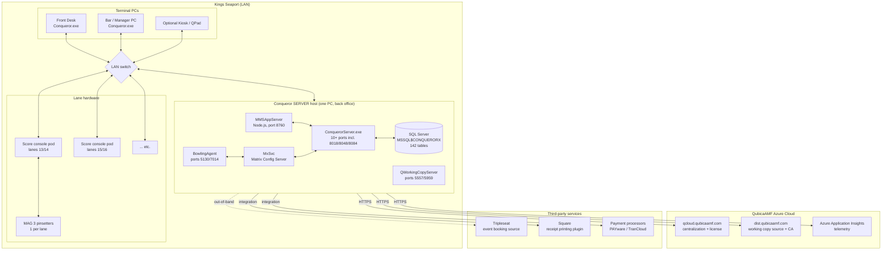
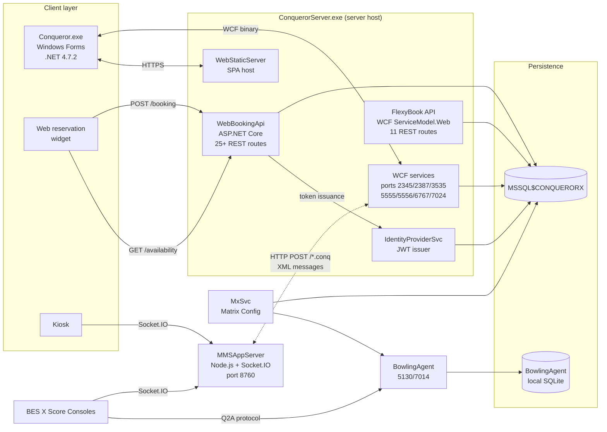
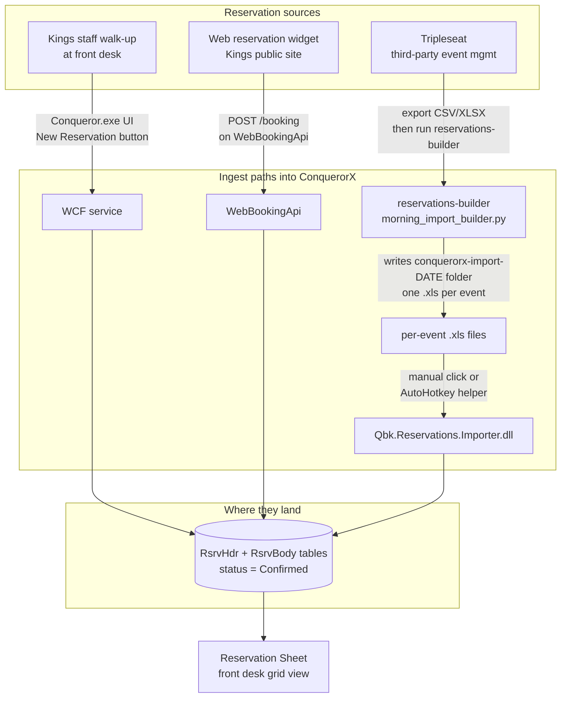
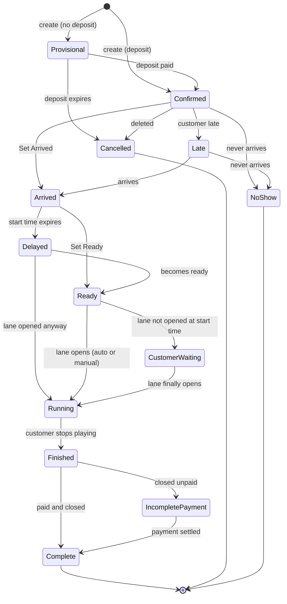

# Master Architecture Visual

One document, five Mermaid diagrams. Ties every other doc in this set
together at a glance. Read this after `00-executive-summary.md` when a
new reader wants the whole system on one page.

The five diagrams below each answer a distinct question:

1. **Where does everything live?** (physical deployment)
2. **Who talks to whom?** (component + protocol graph)
3. **How does data get in?** (ingest paths from Tripleseat, web reservations, walk-ins)
4. **What state does a reservation move through?** (lifecycle end-to-end)
5. **What are the layers?** (stack, from lane hardware to Azure cloud)

## 1. Physical deployment (where things live)



## 2. Component + protocol graph (who talks to whom)



## 3. How reservations get in (three ingest paths)



Our `reservations-builder` is the third path. Documented in
[`14-booking-system-reference.md`](14-booking-system-reference.md).
The API path (WebBookingApi) is the migration target documented in
[`17-api-surface.md`](17-api-surface.md).

## 4. Reservation state machine (the 12 statuses)

Full lifecycle from creation to complete. See
[`14-booking-system-reference.md`](14-booking-system-reference.md) for
per-status detail; this compressed version shows the whole picture.



## 5. Layer stack (bottom-up)

```mermaid
flowchart BT
    L1[Layer 1: Physical hardware<br/>MAG 3 pinsetters · BES X score consoles · MMS displays · POS printers · cash drawers]
    L2[Layer 2: Hardware bridge<br/>BowlingAgent · Q2A protocol · MMSAppServer Node.js]
    L3[Layer 3: Windows services + coordinator<br/>MxSvc · SQL Server MSSQL$CONQUERORX · QWorkingCopyServer]
    L4[Layer 4: Business logic<br/>Qbk.*.Server.dll domain services · CenterReservationSvc · CenterCustomerSvc · CenterPaymentSvc etc.]
    L5[Layer 5: API façades<br/>WebBookingApi (ASP.NET Core) · FlexyBook (WCF) · WCF legacy service ports]
    L6[Layer 6: Front-end clients<br/>Conqueror.exe · Web reservation widget · Kiosk · Score console UI]
    L7[Layer 7: Cloud + telemetry<br/>QCloud · QPortal · Azure Application Insights · Working Copy update pipeline]

    L1 --> L2
    L2 --> L3
    L3 --> L4
    L4 --> L5
    L5 --> L6
    L6 -.-> L7
    L3 -.-> L7
    L4 -.-> L7
```

## Reading order for a new team member

1. Start here (`24-master-architecture.md`) for the 30-second picture
2. Then [`00-executive-summary.md`](00-executive-summary.md) for the 10-key-facts elevator pitch
3. Then [`01-architecture.md`](01-architecture.md) for the deployment-model detail
4. Then whichever module doc matches the day's job:
   - Working on reservations: [`14-booking-system-reference.md`](14-booking-system-reference.md)
   - Working on lanes: [`16-lane-management.md`](16-lane-management.md)
   - Working on POS: [`19-point-of-sale.md`](19-point-of-sale.md)
   - Working on membership: [`21-fbt-membership.md`](21-fbt-membership.md)
   - Working on shifts: [`20-shift-management.md`](20-shift-management.md)
   - Working on config: [`22-center-setup.md`](22-center-setup.md)
   - Working on integrations: [`10-integrations.md`](10-integrations.md), [`17-api-surface.md`](17-api-surface.md), [`18-mms-realtime.md`](18-mms-realtime.md)
   - Working on troubleshooting: [`13-operations-troubleshooting.md`](13-operations-troubleshooting.md)

## Reference

- Full doc index: [`README.md`](README.md)
- Raw evidence backing every claim: [`inventories/`](inventories/)
- Official product docs mined in full: [`extracted-strings/`](extracted-strings/)
