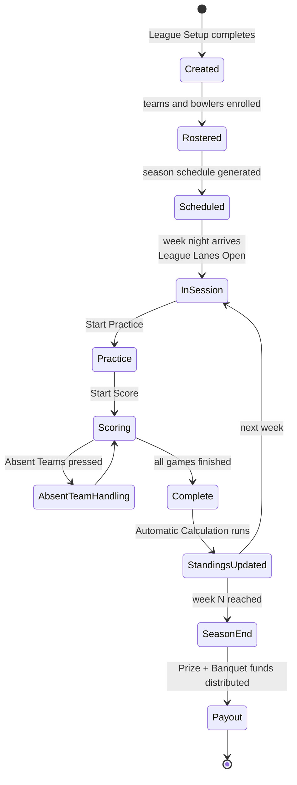

# Leagues Reference

League play across the four league variants ConquerorX ships. From CHM
sections `Conqueror-2-209.html` through `Conqueror-2-287.html` (four
top-level sections spanning ~50 sub-pages).

The four variants:

| Variant | Purpose | CHM sections |
|---|---|---|
| **LEAGUES** (standard) | Full-featured native league engine | `2-209` to `2-237` |
| **BLS LEAGUES** | CDE Software Bowling League Secretary format | `2-238` to `2-246` |
| **SWEDISH LEAGUES** | Sweden-specific format | `2-266` to `2-276` |
| **DANISH LEAGUES** | Denmark-specific format | `2-277` to `2-287` |

Not covered in this doc (they are their own product areas):
**TOURNAMENTS** (`2-247` to `2-265`) is a distinct module.

Kings runs the standard **LEAGUES** variant (US operation). The
Swedish and Danish variants are separate first-class modules because
those countries have distinct national league rules that would be
awkward to bolt on as config toggles.

## Standard LEAGUES (Kings-relevant)

### Managing an active league (from `Conqueror-2-211.html`)

Day-to-day operations on a running league:

- **Opening League Lanes:** start the league session on assigned lanes
- **Turning Pinsetters on/off:** per-lane pinsetter control
- **Closing League Lanes:** end the session, roll scores forward
- **Zooming in/out the Lanes:** UI zoom for the lane grid

### Creating a League (from `Conqueror-2-213.html`): 17 setup fields

| Field | What it controls |
|---|---|
| **Number of Teams** | Season size |
| **Number of Players per Team** | Roster size |
| **Maximum Number of Permanent Team Substitutes** | Sub roster |
| **Number of Weeks** | Season length |
| **Number of Games per Week** | Games per session |
| **Teams per Pair** | How many teams share one lane pair |
| **Lane Set** | Which physical lanes the league uses |
| **Schedule Type** | Round-robin / bracket / other |
| **Play Date and Time** | Recurring slot |
| **Bowler Category Type** | Amateur / pro / mixed |
| **Calculation Rule** | Scoring math variant |
| **Automatic Calculation** | Auto-compute standings after each session |
| **Bowling Type** | Standard / no-tap / other rule mods |
| **Automatic Lane Closure** | Auto-end at series end |
| **Auto Pinsetter on During Practice** | Pinsetter behavior during practice |
| **Send Roster Substitutes** | Sub-management flow |
| **Lane Options** | Per-lane overrides (bumpers etc.) |
| **Score Sheet** | Which score sheet template applies |
| **Reservations** | Whether league night blocks reservations |

### League Setup sub-sections (from `Conqueror-2-212.html` onward)

| # | Sub-section | Purpose |
|---|---|---|
| 3.1 | Creating a League | Section above |
| 3.2 | Setting the League Handicaps | Team + Bowler handicap math |
| 3.3 | Setting the Average Rules | How league averages are computed and locked |
| 3.4 | Setting the Player Categories | Category definitions per league |
| 3.5 | Managing the Team Pairing | Weekly schedule + roll-off nights |
| 3.6 | Setting Point Attribution | Automatic Points, Team + Player rules, Regressive Points, **Peterson Points** |
| 3.7 | Legal Line up | Forfeit rules and point attribution |
| 3.8 | Setting the League Standard Standing | Standings display and tie-breaks |
| 3.9 | Consulting Modification Logs | Audit trail |
| 3.10 | Setting the League Payments | Financial model (see below) |

### Handicaps (3.2)

Two independent handicap systems:

- **Team Handicap:** added to team score
- **Bowler Handicap:** added per bowler

Formulae are configurable per league.

### Average rules (3.3)

- **Minimum Number of Games for Establishing League Average:** how
  many games a bowler must play before their average is used for
  handicap
- **Apply League Average to Games Already Played:** whether the
  average recomputes retroactively
- **Maintain the Same Average for the Entire Series:** locks average
  for a series run

### Point attribution (3.6)

Multiple scoring systems supported:

- **Automatic Points:** points auto-computed per rule
- **Team Point Attribution Rules:** per-team logic
- **Player Point Attribution Rules:** per-bowler logic
- **Regressive Points:** degrading point values with position
- **Peterson Points:** the Peterson scoring system (a US bowling
  standard for team leagues that awards points per game and per series
  based on ranking)

### Financials (3.10)

Comprehensive per-league financial model:

- **Structured Number of Players:** expected roster size for
  budgeting
- **Linage and Linage Total:** per-lane fee accumulation ("linage" is
  bowling industry term for lane use fees)
- **Prize Fund and Banquet Fund:** separate pools that accumulate
  through the season
- **Total per Player / Included Taxes:** final per-player price
- **Enrolled Number of Players:** actual roster size
- **Guarantee Players:** minimum guaranteed enrollment
- **Generic Fund:** miscellaneous fund
- **One Game Price:** per-game fee for makeup games

## BLS LEAGUES (`Conqueror-2-238.html` onward)

**BLS = Bowling League Secretary**, from CDE Software (external
vendor, still active). Long-standing US bowling league management
standard. ConquerorX has a native BLS-compatible mode so centers with
existing BLS data can migrate.

Simpler surface than standard LEAGUES:

| Field | Purpose |
|---|---|
| League Type | BLS category |
| Week Day + Games per Session + Week Number | Schedule basics |
| Structured / Enrolled Number of Players | Roster planning + reality |
| Financials sub-section | Fees + prize fund |
| Technical sub-section | Automatic lane closure, delay, substitutes, keyboard-driven handicap edits, practice pinsetter, bowling type, lanes-in-pair, options |
| League Payments | Money flow |
| League Lanes | Per-lane control: Start Practice, Send Roster, Start Score, League off, Pinsetter on/off, Absent Teams, Options |
| Opening and Closing a League | Session lifecycle |

Kings almost certainly runs standard LEAGUES not BLS mode, since
BLS-mode is for centers migrating in existing CDE data.

## SWEDISH LEAGUES (`Conqueror-2-266.html`)

Dedicated Sweden variant. Structural differences from standard:

- **Series** as the primary organizing unit (not weeks)
- **Bonus Points for Pairs** and **Bonus Points for Series** built in
- **Home Team / Visitor Team** naming convention (head-to-head focus)
- **On the Monitors** setting for score-display behavior specific to
  the Swedish score-console layout

Setup pages: Global, Teams and Players, Movement, Point Assignment.

## DANISH LEAGUES (`Conqueror-2-277.html`)

Almost identical structure to Swedish Leagues but with Denmark-specific
defaults. Sub-sections match: Global, Teams and Players, Movement,
Point Assignment. Same Home/Visitor and Bonus Points concepts.

The two are separate modules rather than one "Nordic Leagues" module,
which suggests the national governing bodies enforce meaningfully
different rules that could not be unified.

## Related SQL tables (all four variants share these)

From [`05-database-schema.md`](05-database-schema.md):

- `FBTLeague`: league membership tied to FBT
- `FBTLinks`: link tables for league entities
- `FBTStats`: league stats per member
- `ClubLeague`: club-level league data
- `GiocatoriLeague`: league players (Italian: "giocatori" = players)
- `ListaLeague`: league list (Italian: "lista" = list)
- `MemoLeague`: league memo
- `PayLeague`: league payments
- `PisteLeague`: league lanes (Italian: "piste" = lanes)
- `PointsCollection`: points ledger
- `SetupLeague`: league setup
- `LeagueOptions`: per-league options
- `LeaguePayHistory`: payment history
- `ApriPiste`: opened lanes ("apri" = open) with league tie-in

## Related Crystal Reports (from `15-reports-catalog.md`)

The Classification*.rpt and League*.rpt families are the league output
reports:

- `ClassificationClubPlayer.rpt`, `ClassificationGames.rpt`
- `ClassificationBestGame.rpt` (+ WithoutTeamColumn variant)
- `ClassificationPlayer.rpt` (+ WithoutTeamColumn + OnSeries variants)
- `ClassificationGenericSwedishLeague.rpt`
- `ClassificationSwedishLeagueElite.rpt`, `ClassificationSwedishLeagueEliteTeam.rpt`
- `ClassificDetailOrdered.rpt`
- `LeagueBestPlayers.rpt`, `LeagueBestTeams.rpt`
- `LeaguePlayerStat.rpt`, `LeagueTeamStat.rpt`
- `LeaguePayments.rpt`
- `LeagueCalendarReport.rpt`, `LeagueCalendarSchedule.rpt`, `LeagueCalendarTeams.rpt`
- `LeagueAttendanceRpt.rpt` (the built-in menu report)
- `HighGamesStandingsReport.rpt`, `HighScoresStandingDualMode.rpt`
- `MagicNumber.rpt` (magic-number standings math)
- `TeamRoster3.rpt`, `TeamRoster6.rpt`, `TeamStandings.rpt`

## Related DLL family (from `04-modules-and-dlls.md`)

12 Leagues DLLs:

- `Qbk.Leagues.dll`, `Qbk.Leagues.Server.dll`
- `Qbk.Leagues.ClientLib.dll`
- `Qbk.Leagues.CDE.dll`: the BLS/CDE-compatibility layer
- `Qbk.Leagues.BowlersAndTeams.dll`
- `Qbk.Leagues.LaneStatus.dll`
- `Qbk.Leagues.ScoreSheet.dll`
- `Qbk.Leagues.Setup.dll`
- `Qbk.Leagues.Standings.dll` + `.Client.dll`

## League lifecycle (Mermaid)

## For our tooling

Our reservations-builder handles OPEN reservations, not league nights.
League bookings are managed inside the Leagues module directly. If we
ever extend to league-support:

- Standard LEAGUES has the richest surface and would be the primary
  target
- The 17-field creation form maps to a distinct set of `SetupLeague` +
  `LeagueOptions` DB rows
- League nights and open reservations must not collide on the same
  lanes at the same time; the Booking System's overbooking area is
  where such conflicts land visually

## Reference

- Related Tournaments module (not covered here): CHM `2-247` to `2-265`
- Booking System (open reservations, non-league): [`14-booking-system-reference.md`](14-booking-system-reference.md)
- Lane Management (lane state feeds league sessions): [`16-lane-management.md`](16-lane-management.md)
- FBT (league players are usually FBT members): [`21-fbt-membership.md`](21-fbt-membership.md)
- CHM outline anchor: [`extracted-strings/chm-en-outline.md`](extracted-strings/chm-en-outline.md#leagues)
