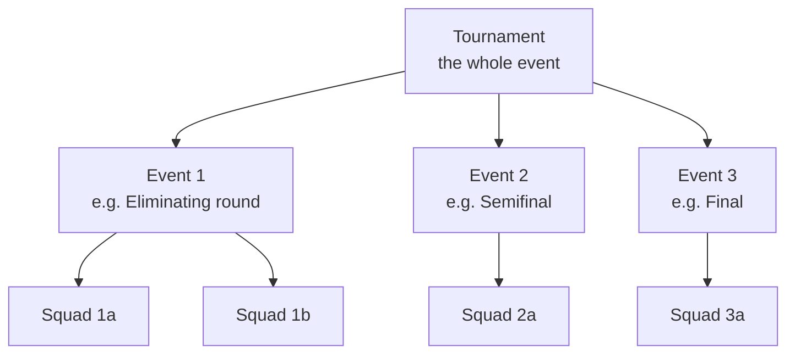
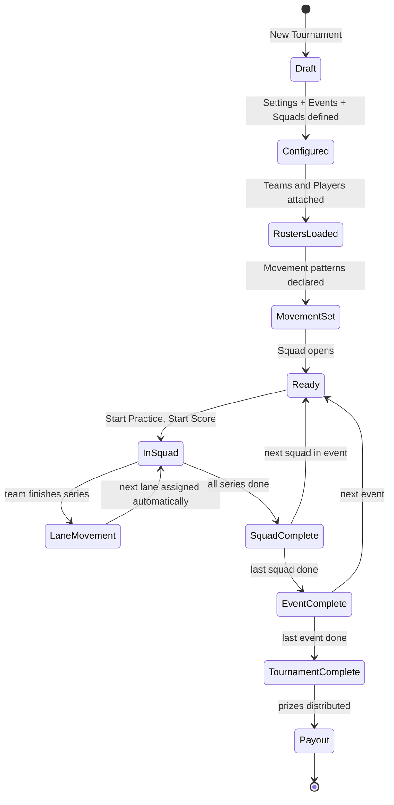

# Tournaments Reference

One-shot competitive events. From CHM sections `Conqueror-2-247.html`
through `Conqueror-2-265.html` (9 sub-sections). Parallel in shape to
Leagues (doc 25) but for finite events instead of recurring seasons.

Kings runs occasional tournaments (corporate outings, championship
events, private league playoffs). The Tournaments module handles the
whole lifecycle: setup, roster, squad scheduling, lane movement, live
scoring, standings, prize distribution.

## What makes it interesting

From `Conqueror-2-248.html`:

The Tournaments module is designed to define **all movements in advance
and manage them automatically during the event without operator
intervention**. When a team finishes their series, they queue for their
next lane, and as soon as that lane is free, the module prepares it for
the arriving team. No front-desk staff needs to shepherd movement.

This is the same auto-scheduling engine used for the Leagues module,
but with tournament-specific movement patterns (baker format,
step-ladder, round-robin variations).

## Three-level hierarchy

Every tournament has three nested layers:

- **Tournament** is the container. Has settings like Bowling Type,
  Division Style, Start Date, Description.
- **Events** are named sub-rounds inside a tournament. Each event
  can have distinctly different rules ("Eliminating", "Final", etc.).
- **Squads** are actual bowling sessions inside an event. Each squad
  runs on specific lanes at a specific time.

## Tournament Settings (from `Conqueror-2-251.html`)

| Field | Purpose |
|---|---|
| **New / Copy from** | Create fresh or clone an existing tournament as template |
| **Rename** | Rename tournament |
| **Bowling Type** | Standard / no-tap / other rule mods |
| **Tournament Start Date** | Overall event date |
| **Division Style** | How divisions organize teams |
| **Auto Pinsetter on During Practice** | Pinsetter behavior in practice |
| **Description / Note** | Free-text metadata |
| **Pay** | Payment configuration |
| **Delete** | Remove the tournament |

## Event Settings (from `Conqueror-2-252.html`)

| Field | Purpose |
|---|---|
| **Event Start Date / Time** | When this event fires |
| **Type** | Event category (Qualifying, Final, etc.) |
| **Maximum Amount of Substitutes** | Sub cap per team |
| **Lanes in Pair** | How many lanes are paired for movement math |
| **Show Teams for Single Tournament** | Display flag |
| **Individual Handicap** | Enable per-player handicap for this event |
| **Add / Rename / Delete** | Event lifecycle |

## Teams and Players (from `Conqueror-2-253.html`)

### Player Setup (`2-254`)

- **Creating a Player:** new player record inside the tournament
- **Deleting a Player:** remove player (audit-tracked)
- **Modifying Player Data:** update player details
- **Importing a Player:** pull an existing FBT member into the tournament

### Team Setup (`2-255`)

- **Creating a Team**
- **Inserting Players in Team**
- **Modifying / Deleting a Team**
- **Position within the Team:** batting-order equivalent
- **Creating a Player Directly in the Team:** one-step player + team
- **Replacing a Team Previously Sent to Lanes:** mid-event roster swap

## Squad Setup (from `Conqueror-2-256.html`)

The busiest area. Four tabs per squad:

### 5.1 Global (`2-257`)

Squad-level configuration:

| Field | Purpose |
|---|---|
| **Lanes** | Which physical lanes this squad uses |
| **Teams per Lane** | How many teams share a lane |
| **Games per Series** | Games in one series |
| **Series** | Number of series |
| **Total Number of Games** | Auto-computed from series × games |
| **Total Lane Movements** | How many times teams move lanes during the squad |
| **Last Game Played** | Current position |
| **Start Date / Time** | Squad start |
| **Auto Pinsetter on During Practice** | |
| **Automatically Add Vacant Bowler** | Auto-fill roster when short |

### 5.2 Teams and Players (`2-258`)

Squad roster management:

- **Import from Lanes:** pull whoever is currently on the lanes
- **Modify Team / Modify Player**
- **Import:** bring in players/teams from FBT or from another squad
- **Sign in:** mark team present at squad start
- **Delete**

### 5.3 Movement (`2-259`)

The auto-shuffle engine that makes tournaments run without operator
babysitting:

- **Assign:** set movement pattern
- **Remove:** clear a movement
- **Movement Type:** the pattern (Baker, Kelly, Standard, etc.)
- **Modify:** tweak a specific movement
- **Opponents:** declare opponent matchups

### 5.4 Point Assignment (`2-260`)

Per-squad scoring rule overrides.

## Standing Setup (from `Conqueror-2-261.html`)

Standings display and output:

- **Export:** CSV / Excel export
- **Message:** broadcast standings to score displays
- **Print:** physical print
- **Preview:** on-screen
- **Quick Squad Sign-in** (`2-262`), fast in-squad sign-in path

## Game Manager (from `Conqueror-2-263.html`)

Post-hoc game record management:

- Insert / Copy / Delete / Modify / Find a Game

Same audit-tracked shape as the FBT Historical Games manager.

## Creating a Division (from `Conqueror-2-264.html`)

Groups of teams competing under the same rules. Divisions are
tournament-scoped:

- **New** / **Modify** / **Order** / **Delete**

## Tournament Setup (per-center defaults, from `Conqueror-2-265.html`)

Center-wide defaults every new tournament inherits:

- **Default Tournament Lane Option Set**
- **Default Team Name Prefix**
- **Default Player Name Prefix**
- **How to Display Ties in Standings**
- **Delay in Closing Lanes**
- **Automatic Lane Closure**
- **Download Games in Real Time:** pull scores as they happen for
  cloud sync / live-feed use

## Tournament vs League: when to use which

| Dimension | Tournament | League |
|---|---|---|
| **Duration** | One event, hours to a weekend | Weeks or months, recurring |
| **Structure** | 3 layers (Tournament, Event, Squad) | Flat (League + Weekly Sessions) |
| **Movement** | Automatic team shuffling between squads | Fixed weekly pairings |
| **Scoring** | Event-scoped rules can differ within one tournament | Consistent rules for whole season |
| **Money** | Simpler entry fee + prize | Complex Prize Fund + Banquet Fund + linage across weeks |
| **FBT tie-in** | Optional player-level FBT import | Usually league members are FBT members |
| **Use at Kings** | Corporate outings, private championships | Regular weekly leagues |

## Related SQL tables (`T_` prefix, all tournament-scoped)

From [`05-database-schema.md`](05-database-schema.md):

- `T_Tournaments`: the top-level tournament record
- `T_TournamentsDivisions`: division-tournament links
- `T_Divisions` + `T_DivisionsStyles`: divisions and their styles
- `T_Events`: events inside tournaments
- `T_Squads`: squads inside events
- `T_LaneAssignment`: lane assignments per squad
- `T_Players` + `T_PlayersDivisions`: players and their divisions
- `T_Teams` + `T_TeamsComposition`: teams and their rosters
- `T_PointsCollectionRules` + `T_PointsCollectionStyles`: scoring rules
- `T_StandingSheetTypes`: standings display templates

## Related Crystal Reports

From [`15-reports-catalog.md`](15-reports-catalog.md):

- `TournamentsPlayers.rpt` (+ Hdcp variant), player standings
- `TournamentsTeams.rpt` (+ Hdcp variant), team standings

## Related DLL family

From [`04-modules-and-dlls.md`](04-modules-and-dlls.md), 9 Tournaments DLLs:

- `Qbk.Tournaments.dll`, `Qbk.Tournaments.Server.dll`
- `Qbk.Tournaments.Client.dll`, `Qbk.Tournaments.Gui.dll`
- `Qbk.Tournaments.Interop.dll`
- `Qbk.Tournament.Gui.dll` (singular variant)
- `Qbk.Tournament.Standing.dll`

## Tournament import template

From [`08-templates-and-imports.md`](08-templates-and-imports.md):

`C:\QDesk\Bin\xlt\TournamentPlayers.xlt` is the Excel import template
for pre-populating tournament rosters. Same shape as the Reservation
import template but with tournament fields. Not decoded in detail yet,
but the template exists if we ever want to build a Tripleseat-driven
tournament import.

## Tournament lifecycle (Mermaid)

## For our tooling

Our reservations-builder does not touch tournaments. If we ever
extended:

- The `TournamentPlayers.xlt` template is the parallel to
  `ReservationDetailsImport.xlt` we already handle. Similar layout
  strategy would apply (single-file per tournament, per-player rows).
- Auto-movement means a tournament import that only supplies the top
  layer + roster is enough; ConquerorX generates the movement plan
  automatically once the operator opens the first squad.

## Reference

- Leagues (sister module, recurring not one-shot): [`25-leagues.md`](25-leagues.md)
- Booking System (walk-in reservations, non-league, non-tournament): [`14-booking-system-reference.md`](14-booking-system-reference.md)
- Lane Management (lane state during squads): [`16-lane-management.md`](16-lane-management.md)
- FBT (tournament players often FBT members): [`21-fbt-membership.md`](21-fbt-membership.md)
- CHM outline anchor: [`extracted-strings/chm-en-outline.md`](extracted-strings/chm-en-outline.md#tournaments)
