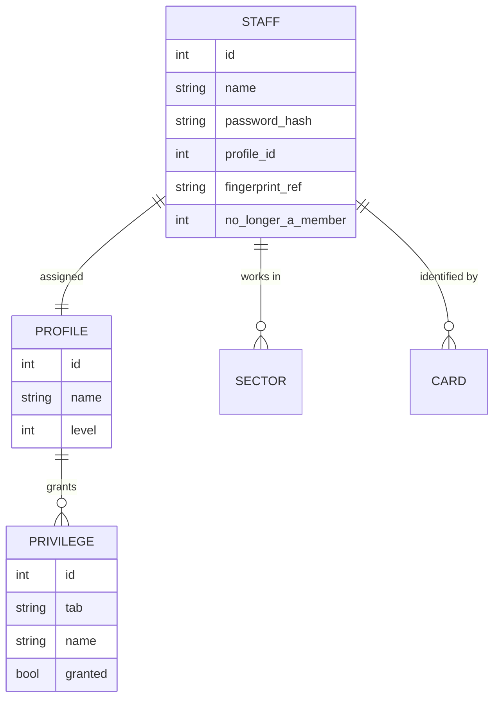
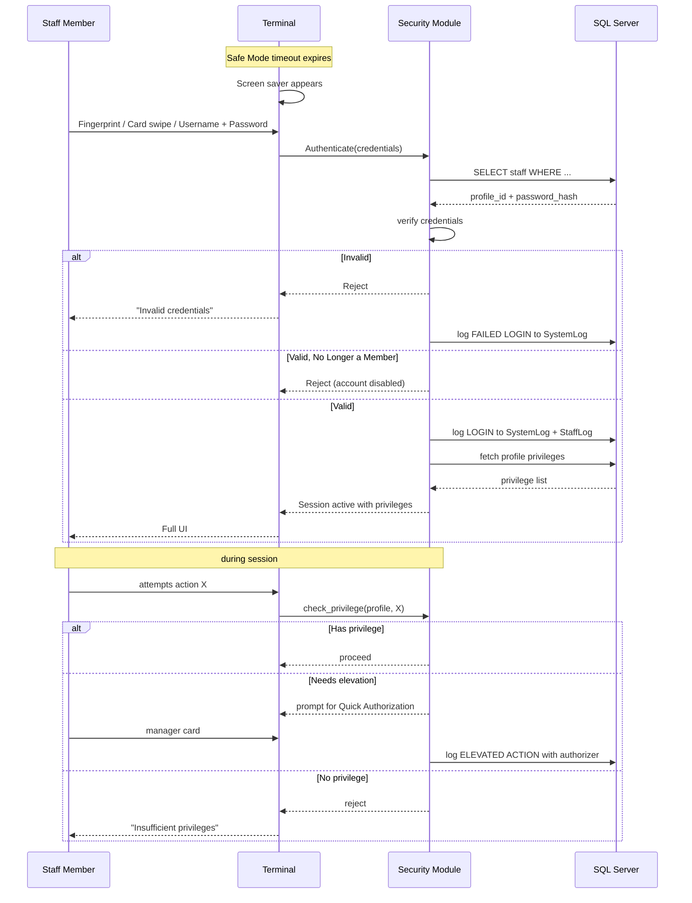

# Security Reference

Staff authentication, profiles, privileges, safe mode, and audit log.
From CHM sections `Conqueror-2-348.html` through `Conqueror-2-358.html`
(8 sub-sections). This is the module that decides who can do what
inside ConquerorX.

Kings runs Security in enabled mode (implied by the fact that the
opening and closing managers have distinct authority levels).

## What Security is (from `Conqueror-2-349.html`)

Privileged-access model. Each user is assigned a **Profile**. Each
profile carries a set of **Privileges** covering different areas of
the product. On login, the user identifies themselves via one of three
recognition modes:

1. Fingerprint scanner
2. Membership card swipe
3. Username + Password

The system then loads their profile and enforces per-privilege access
throughout the session.

## The three moving parts

## Staff Setup (from `Conqueror-2-350.html`)

Manages the staff roster. Operations:

- **Creating / Deleting a Staff Member:** CRUD on the staff record
- **Assigning Profiles:** hook a staff member to one of the defined
  Profiles
- **Sectors:** which sectors (bowling, F+B, pro shop, lockers, etc.)
  the staff member can operate in (see [`20-shift-management.md`](20-shift-management.md))
- **Staff Member Cards:** per-staff physical/magnetic cards for swipe
  login
- **User Recognition Modes:** enable one or more of the three modes
  per staff (a manager might have fingerprint + password; a bartender
  might only have card swipe)

## User Profile Setup (from `Conqueror-2-351.html`)

Manages the profile catalog. A profile is a named bundle of
privileges. Ops:

- **Creating a User Profile**
- **Modifying User Profiles**
- **Importing / Exporting Profiles:** profiles can be shared across
  centers via export/import (useful for a chain like Kings with 10
  locations to keep role definitions consistent)
- **Profile Levels:** hierarchical order (manager > lead > operator)
  that affects who can override whom

## Privilege Tabs (from `Conqueror-2-352.html`)

Privileges are organized into 6 tabs. Each tab is a set of related
capabilities:

| Tab | Covers |
|---|---|
| **Operate** | Basic operational actions (lane control, POS, tabs) |
| **Shifts** | Cash drawer ops, shift close, shift report access |
| **Prices** | Discount authority, price key overrides, refund limits |
| **Technical** | Lane workshop, pinsetter control, TCS acknowledge, hardware config |
| **Management** | Delete shift, delete customer, view all reports, staff mgmt, backups |
| **Reservations** | Booking system access, edit others' bookings, cancel bookings |

Every checkbox on each tab is one specific privilege. Kings' opening
manager profile presumably has most Operate + Reservations + some
Shifts. The GM has all 6 tabs fully enabled.

## Quick Authorization (from `Conqueror-2-353.html`)

Temporary privilege elevation. A junior staff member requests a
specific action requiring higher privilege; a manager scans a card /
enters credentials to authorize just that one action; the log records
who authorized what. Common use: junior cashier processes a refund
that requires manager approval.

## Safe Mode (from `Conqueror-2-354.html`)

Terminal-level lock. After a predefined idle timeout (Center Setup >
Basic > Automatic Safe Mode After), the terminal shows a screen saver.
Any staff swipe / login unlocks it back to whoever was signed in.

Kings should have this enabled on every terminal. Prevents anyone
walking up to an unattended terminal from pretending to be the last
signed-in cashier.

## User Log on / Log off (from `Conqueror-2-355.html`)

### Log on options

- **Select User Profile:** the login screen shows recent profiles
  as a shortcut
- **Change Password:** self-service password rotation
- **Center to Connect to:** for chain deployments, staff picks which
  center they are logging into

### Log off (`2-356`)

Explicit logoff closes the session and can also trigger
time-tracking log-off (see [`28-time-tracking.md`](28-time-tracking.md)).

## System Log Events (from `Conqueror-2-357.html`)

Every login, logout, privileged action, and configuration change lands
in the System Log. Managers can:

- **Zoom:** expand event detail
- **Filter:** by user, date, event type
- **Print:** physical print for audit
- **Delete:** remove records (audit-tracked)
- **Maximum Log Number:** retention limit config

Backed by the `SystemLog` and `StrikerLog` tables in the DB.

## Suspect Actions (from `Conqueror-2-358.html`)

Automated anomaly detection that flags patterns like:

- Repeated failed logins
- Refunds outside normal parameters
- Configuration changes at unusual hours
- Deleted transactions

Whatever the rule set, flagged events surface in a manager-review
queue. Complements the raw System Log with automated triage.

## Login flow (Mermaid)

## Related SQL tables

From [`05-database-schema.md`](05-database-schema.md):

- `Staff`: staff roster
- `StaffLog`: per-staff activity log
- `StaffSectors`: staff-to-sector membership
- `Profiles`: profile catalog
- `UserProfiles`: user-to-profile links
- `AccessRights`: the privilege matrix (profile × privilege boolean)
- `SystemLog`: global event log (populated by `qsp_log_insert` and by
  the Security module directly)
- `StrikerLog`: related audit table

## Related DLL family

From [`04-modules-and-dlls.md`](04-modules-and-dlls.md):

- `Qbk.Security.Server.dll`
- `CenterSecuritySvc.Services.dll`
- `IdentityProviderSvc.Service.dll`: JWT issuer for the WebBookingApi
  authentication flow (see [`17-api-surface.md`](17-api-surface.md#authentication))

## Notable overlaps with other docs

- **Shifts:** every cashier action ties to a shift + staff record
  (see [`20-shift-management.md`](20-shift-management.md))
- **Center Setup** > Basic, Security toggle, Password Expiration,
  Login Attempts Before Disabling, Automatic Safe Mode After, Boss
  Password (see [`22-center-setup.md`](22-center-setup.md))
- **FBT:** Staff Member Cards can be aliased to FBT records (see
  [`21-fbt-membership.md`](21-fbt-membership.md))

## For our tooling

Our reservations-builder does not directly touch Security. But:

- If we ever build against the WebBookingApi (see
  [`17-api-surface.md`](17-api-surface.md)), auth flows through
  IdentityProviderSvc issuing JWTs to whoever we authenticate as.
  That "whoever" is a Staff record with a User Profile granting the
  Reservations privilege tab.
- If we ever build a manager dashboard, the SystemLog table is the
  audit source.
- If we ever automate an operator action, we need a staff record for
  the automation with a purpose-built profile granting only the
  minimum needed privileges.

## Reference

- Related shift + cash drawer model: [`20-shift-management.md`](20-shift-management.md)
- Related Center Setup security knobs: [`22-center-setup.md`](22-center-setup.md)
- REST API auth surface (JWT + IdentityProviderSvc): [`17-api-surface.md`](17-api-surface.md#authentication)
- CHM outline anchor: [`extracted-strings/chm-en-outline.md`](extracted-strings/chm-en-outline.md#security)
