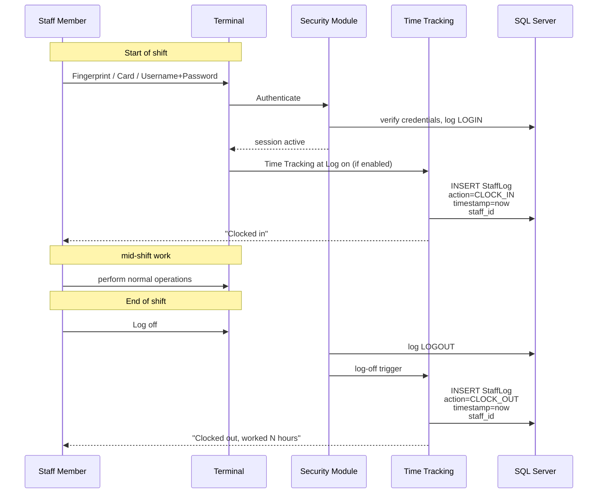

# Time Tracking System Reference

Staff clock-in / clock-out tracking. From CHM sections
`Conqueror-2-359.html` through `Conqueror-2-363.html` (3 sub-sections).
Small module but operationally important, replaces paper time sheets
with tamper-resistant login-tied records.

Kings almost surely uses this since payroll depends on accurate staff
hours, and manual time sheets are error-prone.

## What Time Tracking does (from `Conqueror-2-360.html`)

Registers every staff clock-in and clock-out event. Each event ties to
a specific staff member via the same Security recognition flow
(fingerprint, card swipe, or username + password). Records land in
the `Staff Log Events` tab for later review, export, and payroll
calculation.

If Security is enabled in Center Setup, the **Time Tracking at Log on /
Log off** option triggers the Time Tracking window automatically the
first time a staff member logs in for a shift. That combines the two
actions (system login + clock-in) into one flow, saving the staff
member a second action.

## The clock-in / clock-out flow (Mermaid)

## Staff Log Actions (from `Conqueror-2-362.html`)

Manager tooling on the Staff Log:

| Action | Purpose |
|---|---|
| **Modify** | Correct a mis-recorded event (audit-tracked) |
| **Add** | Add a missing event manually (staff forgot to swipe) |
| **Delete** | Remove a record (audit-tracked) |
| **Zoom** | Expand event detail |
| **Filter** | Narrow by staff, date range, event type |
| **Print** | Physical printout for payroll or records |

Any Modify / Add / Delete gets its own audit entry, so a manager
can't silently rewrite hours. This is exactly how it needs to work
for payroll disputes to be resolvable.

## Time Tracking Reports (from `Conqueror-2-363.html`)

The reports side of the module. Two Crystal templates back it,
already documented in [`15-reports-catalog.md`](15-reports-catalog.md):

- `IndividualTimeTracking.rpt`: per-staff hours, one report per person
- `GlobalTimeTracking.rpt`: all-staff aggregate for payroll pull

Both filter by date range and can export to CSV / Excel for a payroll
system.

## Wiring to Security (from `Conqueror-2-360.html` and Center Setup)

Time Tracking is not standalone: it composes with Security and shifts.
The relevant configuration lives across three modules:

| Setting | Location | Purpose |
|---|---|---|
| **Time Tracking at Log on/Log off** | Center Setup > Basic | Trigger the Time Tracking popup on Security login/logout |
| **Security enabled** | Center Setup > Basic | Required for Time Tracking to tie an event to a specific staff record |
| **Sectors** | Center Setup > Sector Setup | Determines which sector the staff clock-in counts toward |
| **Personal Cash Drawer** | Shift Management setup | Personal drawer clock-in can also tie to Time Tracking |

## Related SQL tables

From [`05-database-schema.md`](05-database-schema.md):

- `StaffLog`: every clock-in / clock-out event (also holds Security
  login events, differentiated by an event-type column)
- `Staff`: the staff roster
- `StaffSectors`: sector assignments (affects which sector hours
  count toward)
- `Shifts`: shift definitions (Time Tracking events are timestamped
  within a shift window)

## Related DLL family

Time Tracking does not have its own top-level Qbk DLL. It lives
inside the Security + Shift modules:

- `Qbk.Security.Server.dll`: enforces the identity portion
- `Qbk.Shift.Server.dll`: reads the staff-log data for shift reports

## Practical implications

- **For payroll integration**: `GlobalTimeTracking.rpt` output is the
  bridge. Export to CSV, feed into whichever payroll system Kings
  uses.
- **For our reservations-builder**: no direct interaction. But if we
  ever build automation that runs as a "staff member" for
  audit-trail purposes, that automated identity would ALSO log
  clock-in/out events, which would show up as strange payroll
  entries. Design consideration for any future automation service
  account.
- **For dispute resolution**: the audit trail on Modify/Add/Delete
  means a payroll dispute can be traced to which manager adjusted
  which record, when, and from which terminal.

## Reference

- Related security identification model: [`27-security.md`](27-security.md)
- Related shift-based cash reconciliation: [`20-shift-management.md`](20-shift-management.md)
- Center-wide Time Tracking toggle: [`22-center-setup.md`](22-center-setup.md)
- CHM outline anchor: [`extracted-strings/chm-en-outline.md`](extracted-strings/chm-en-outline.md#time-tracking-system)
