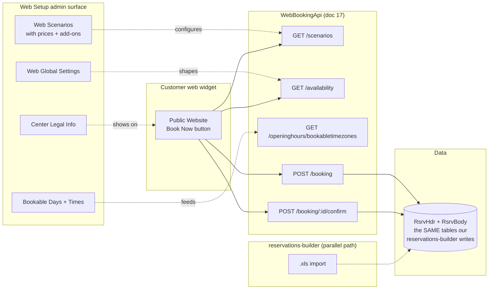

# Web Reservations and Call Center Reference

Two adjacent modules that let bookings reach ConquerorX from
non-front-desk paths. Both matter for a chain like Kings with 10
locations. From CHM sections `Conqueror-2-418.html` through
`Conqueror-2-435.html`.

- **Call Center** (`2-418` to `2-425`), a centralized reservation
  desk that can book into ANY center in the chain.
- **Web Setup / Web Reservations** (`2-426` to `2-435`), customer
  self-service booking widget for a center's public website, plus
  Online Scoring and BES X GameConnect social features.

Both feed into the same `RsrvHdr`/`RsrvBody` tables that our
reservations-builder writes to (see
[`14-booking-system-reference.md`](14-booking-system-reference.md)).

## Call Center (`2-418` onward)

### What it is (from `Conqueror-2-419.html`)

A "Conqueror Pro" solution for bowling chains. **One physical Call
Center desk can take bookings for every center in the chain.** Kings
could theoretically run one central reservation desk that serves all
10 Kings Dining locations.

The Call Center interfaces in real time with each remote center's
Conqueror server. It requires:

- A **Call Center** Conqueror Pro license on the central terminal
- A **Remote Access** license on each remote center
- Network reachability from the Call Center to each remote center's
  ConquerorServer
- Call Center users **also registered as users** at each remote
  center (so authentication survives the switch)

### Operating flow (from `Conqueror-2-420.html` and `2-421.html`)

A center-selection window lets the operator pick which center they
are booking into. The reservation form pre-fills the date, time, and
number of bowlers on the opening page so the operator can define the
key details before diving into per-center context.

Confirmation e-mails send **directly from ConquerorX**, not through
the operator's local mail client. That means outbound confirmations
survive terminal reboots and aren't gated on the operator's Outlook
being open.

### Call Center Reporting (`2-422`)

Consolidated cross-center reporting for the Call Center manager:
volume by center, conversion rate, staff productivity across the
chain.

### Call Center Setup (`2-423` onward)

#### Adding Bowling Centers (`2-424`)

Per-center config on the Call Center side:

| Field | Purpose |
|---|---|
| **Name** | Display name of the remote center |
| **Color** | Visual tint on the center selection window |
| **Server IP Address** | Where to reach that center's ConquerorServer |
| **Welcome Message** | Text shown to the operator when connecting |
| **Authorization Required** | Force credential re-entry on center switch |
| **Currently Available** | Toggle temporarily disable a center for booking |
| **Not Available Because** | Reason text shown when a center is offline |

#### Call Center Settings (`2-425`)

| Field | Purpose |
|---|---|
| **Unsent E-mail Folder** | Retry queue for confirmations that failed to send |
| **Report Folder** | Where consolidated reports save |
| **Confirmation E-mail Templates** | Reusable HTML template library |
| **E-mail Protocol Settings** | SMTP config |
| **Number of Versions to Maintain** | Template version retention |

### Why Kings would care

10 Kings locations means a Call Center is a plausible operational
upgrade. Today, each Kings location fields its own phone-and-web
reservations. If Kings ever centralizes reservation intake (call
center + web widget behind one 800 number pointing everyone to a
single booking desk), the Call Center module is the technical enabler
already sitting inside ConquerorX.

## Web Setup / Web Reservations (`2-426` onward)

### What it is

Customer self-service reservation widget. Powers the "Book Now" flow
on a Kings location's public website. Feeds the same **WebBookingApi**
REST endpoints documented in
[`17-api-surface.md`](17-api-surface.md) (`POST /booking`,
`GET /availability`, `GET /scenarios`, etc.).

### Reservation Scenarios (from `Conqueror-2-428.html`)

A **Web Scenario** is one bookable package the customer can choose
from. Kings might have scenarios like "Weeknight 2-hour bowling",
"Birthday party 4-lane 3-hour", "Corporate outing 6-lane 4-hour with
food package". Each scenario is a bundle:

| Scenario field | Purpose |
|---|---|
| **Name / Picture / Description** | Customer-facing display |
| **Reservation Type** | Which internal type this maps to |
| **Tag** | Categorization / filtering label |
| **Number of Players** | Min / max party size |
| **Allow Web Customer Note** | Whether the customer can add free-text notes |
| **Extended Availability** | Whether this scenario shows up beyond normal open hours |
| **Deposit** | Required deposit amount |
| **Booking Restrictions** | Per-day-of-week, per-time-of-day constraints |
| **Validity Dates** | Season window when this scenario is bookable |
| **Note for Web Customers** | Small print shown at booking time |
| **Lane Groups** | Which lane groups this scenario consumes |
| **Linking Price Keys to the Scenario** | Which prices apply |
| **Customizing Web Price Keys** | Web-specific pricing overrides |
| **Scenario Display Order** | Sort order on the widget |
| **Managing Add-ons** | Available add-ons (shoes, food, arcade credits) |

### Web Reservation Global Settings (`2-429`)

Center-wide web-booking behavior:

| Setting | Purpose |
|---|---|
| **Allow Payment without Activation** | Whether uncertified payment providers can process web bookings |
| **CV2 Code Necessary** | Require CVV for CC bookings |
| **Reservation Time Unit (Minutes)** | Booking granularity (e.g. 30-min slots) |
| **Book before Playing (Hours)** | Minimum lead time |
| **Display Price Keys before/after Selected Time** | Show nearby-slot pricing for context |
| **Maximum Playing Duration after Last Bookable Time** | Late-night cutoff |
| **Default Password for Web Users** | Initial password for web-created accounts |
| **Reservation Conditions** | Terms & conditions text shown at booking |
| **Menu Choice Message** | Prompt for menu-choice items |
| **Disabled Scenario Message** | Fallback text when a scenario is currently disabled |
| **Discount Display Setup** | How discounts render on the widget |
| **Lane Groups** | Center-wide lane group definitions |
| **Fee Setup** | Booking fees / surcharges |

### Bookable Days and Times (`2-430`)

Day-of-week and time-of-day availability grid. Some scenarios can be
booked Monday to Thursday only; others weekends only.

### Center Legal Information (`2-431`)

Content shown to web customers:

- **Disclaimer:** legal fine print
- **Contacts:** phone / e-mail on file
- **Send Confirmation E-mail also to the Center:** auto-BCC every
  confirmation to the venue's ops address
- **Center Website:** canonical URL
- **E-mail Setup:** the SMTP the confirmations go through

### Reservation Confirmation Settings (`2-432`)

E-mail template customization for the confirmations customers receive
after a web booking lands.

### Extended Availability (`2-433`)

Optional module that lets scenarios book into normally-blocked slots
(e.g. league nights) when there is verified capacity. Backed by
`Qbk.Reservations.ExtendedAvailability.Server.dll` (see
[`04-modules-and-dlls.md`](04-modules-and-dlls.md)).

## Online Scoring (`2-434`)

Live-score sharing to the web. Score consoles push game results in
near-real-time to a public web page the bowlers can share with friends
or family. Uses the MMSAppServer realtime layer documented in
[`18-mms-realtime.md`](18-mms-realtime.md).

## BES X GameConnect (`2-435`)

Social integration for score consoles. Legacy Facebook-adjacent
integration ("Fan Page Address" + "Login Post Message" + "Post
Caption" + "Post Description"). Purpose: let bowlers post their
scores to a linked social page directly from the score console. Fields
suggest this is the older BES X + Facebook v1 integration; likely
deprecated on modern deployments but the config surface still ships.

## How our WebBookingApi doc ties in (Mermaid)

The important observation: our `reservations-builder` and the web
widget both hit the same DB tables. If we ever move our tool to the
REST API instead of Excel, we would be calling the SAME `POST /booking`
that the web widget already calls, from a different client.

## Related SQL tables

From [`05-database-schema.md`](05-database-schema.md), most of the
booking-side tables in doc 14 apply. Web-specific additions:

- `RsrvAgencies`: external booking agencies (external partners; a
  Call Center is arguably one)
- `RsrvColourDefs`: color mapping (Web Scenarios use these colors on
  the booking widget)

## Related DLL family

- `Qbk.CallCenter.Server.dll`: Call Center server logic
- `Qbk.WebSetup.dll`: Web Setup config
- `Qbk.Reservations.ExtendedAvailability.Server.dll` /
  `.Client.dll` / `.Gui.dll`: the extended-availability feature
- `Qbk.WebBookingApi.Server.dll`: the REST API layer (see doc 17)

## For Kings specifically

- **Web reservations** are already in use per the Kings public
  websites (playatkings.com and per-location subdomains).
- **Call Center**: unknown whether Kings runs a central call center.
  Would be a plausible operational upgrade for a chain of 10.
- **Online Scoring** and **BES X GameConnect**: likely disabled at
  Kings (upscale entertainment concept, not competitive-league
  social sharing).

## Reference

- Where these bookings end up: [`14-booking-system-reference.md`](14-booking-system-reference.md)
- The REST API that powers the web widget: [`17-api-surface.md`](17-api-surface.md)
- The realtime layer online scoring rides on: [`18-mms-realtime.md`](18-mms-realtime.md)
- Related multi-center Centralization: [`10-integrations.md`](10-integrations.md#qcloud-qubicaamf)
- CHM outline anchors:
  [Call Center](extracted-strings/chm-en-outline.md#call-center),
  [Web Setup](extracted-strings/chm-en-outline.md#web-setup)
