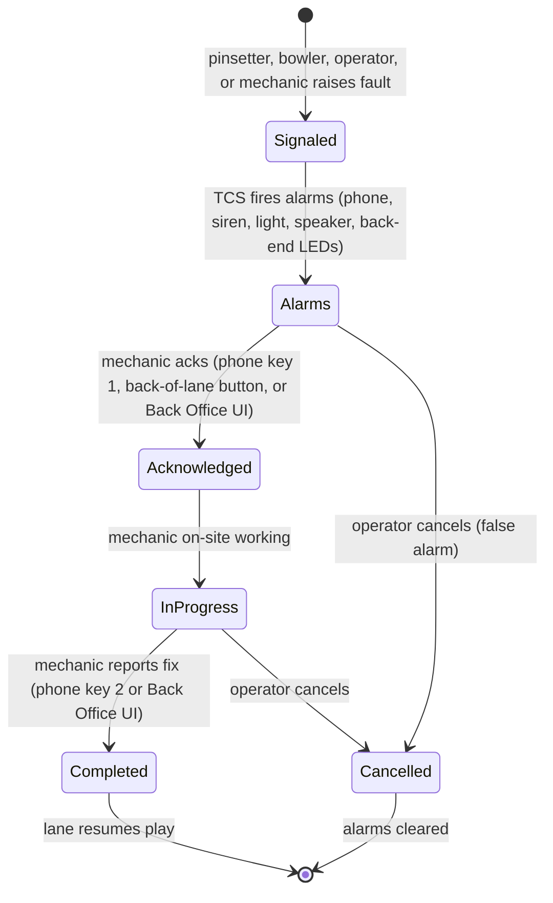

# Trouble Call System (TCS) Reference

CHM-side deep read of the TCS module. From CHM sections
`Conqueror-2-385.html` through `Conqueror-2-401.html`. Companion to
[`13-operations-troubleshooting.md`](13-operations-troubleshooting.md),
which already lists the four TCS actors, alarm surfaces, telephone
codes, and privileges as staff-facing reference. This doc covers the
end-to-end operator workflow, back office trouble-call table, voice
messages, reporting, and the full TCS Setup surface.

**Applies to BES, Bowland, and Bowland-X only.** Older scoring
generations do not run TCS.

## What TCS actually is (`Conqueror-2-386.html`)

TCS provides advanced management of hardware faults that block play:
pinsetter jams, ball return failures, similar mechanical faults. The
value proposition, in QubicaAMF's own words:

- **Automatic mechanic dispatch:** the intelligent MAG 3 pinsetter
  detects a fault, sets off the alarm, and telephones the mechanic
  with a synthesized voice message identifying the lane and error
  type. No operator has to notice and call anyone.
- **Downtime accounting:** every fault is timestamped from signal
  to resolution. Reports quantify how much time each lane was out
  of action, which translates directly to lost revenue.
- **Trend analysis:** frequency-of-error and lane-fault reports
  identify which lanes and which fault types are chronic. Feeds
  capital planning ("this pinsetter needs to be replaced").
- **Two-way telephone communication:** the mechanic uses a touch-tone
  telephone (typically a fixed line on the back-of-house side of the
  lanes) to report status back to Conqueror: acknowledged, in
  progress, completed, cancelled, requesting a partial set, etc.

## The trouble-call lifecycle



## Managing a trouble call: three surfaces

### Surface 1: Lane Status (`Conqueror-2-390.html`)

Path: **Front Desk > All Lanes.**

Front-desk operator sees fault as an icon change on the affected
lane. Click the lane icon, press **Mechanic Service**, and a panel
exposes three actions:

- **Acknowledge**
- **Complete**
- **Cancel**

Lane icons reflect trouble-call status in real time so the operator
knows when it's safe to re-open the lane. Same three actions are
also available to the mechanic via the telephone (see doc 13).

### Surface 2: Back Office > Trouble Call System (`Conqueror-2-391.html`)

Path: **Back Office > Trouble Call System.**

Managerial surface. Top of the window: the trouble-call events table
filtered via the **Filter** button. Selecting an event populates the
bottom of the window with per-event detail:

| Field | Meaning |
|---|---|
| **Date + times of specific actions** | Signal, Acknowledge, Complete timestamps |
| **Lane number** | Which lane |
| **Source** | Who raised the call (terminal, lane, mechanic) |
| **Game Type** | Session context |
| **Error explanation** | Fault code / description |
| **Status** | Signaled / Acknowledged / In Progress / Completed / Cancelled |
| **Mechanic** | Name (entered here for future reference) |

Action buttons expose the same three verbs as Lane Status
(Acknowledge, Complete, Cancel), plus two contextual buttons:

- **Start Work:** substitutes Complete when the mechanic has not yet
  acknowledged the call. Lets the manager mark work as begun
  manually if the mechanic did not phone in.
- **Confirm Lane:** appears when a request covers a pair of lanes
  and the manager needs to specify which of the two lanes actually
  has the problem.

### Surface 3: Voice Messages (`Conqueror-2-392.html`)

Bidirectional voice channel. **Press Voice Messages** from the
trouble-call panel:

- **Send:** operator sends a voice message to the mechanic
  (telephone / loudspeaker) so they know something specific to
  check.
- **Received:** operator plays back voice messages the mechanic
  sent from the phone via key 9 (see doc 13 telephone commands).
  Each received message shows time + date, plays via **Play**, and
  can be **Deleted**.

Practical value: the mechanic can report context beyond the response
codes (e.g. "found a broken belt on the ball return, need to run to
the shop for a spare") without needing to walk back to the console.

## TCS Reports (`Conqueror-2-393.html` and `Conqueror-2-394.html`)

### Filters (`2-393`)

Trouble-call view filter, applies before reporting:

- **Open Calls Only:** hide completed / cancelled calls
- **Filter by Dates:** From / To date range
- **Sort:** by Status or by Date

### Report content (`2-394`)

Each report row includes:

| Column | Purpose |
|---|---|
| **Date** | When the fault occurred |
| **Lane** | Which lane |
| **Opening Mode** | League, open bowling, etc. |
| **Source** | Who raised it |
| **Start** | Signal timestamp |
| **Mechanic Arrival** | Acknowledgement timestamp |
| **End** | Complete timestamp |
| **Response Time** | Signal → Ack |
| **Work Time** | Ack → Complete |
| **Down Time** | Signal → Complete (the actual revenue impact) |
| **Status** | Final status |
| **Mechanic** | Assigned technician |
| **Error / Comments** | Fault description + any operator notes |

The report ends with a summary section. Voice messages sent to the
mechanic are summarized separately (helpful for auditing whether
operators are over-messaging).

Additional views callable from the report layer:

- **Errors per lane** (which lanes fault most)
- **Error frequency** (which fault codes recur most)
- **Down time totals** (rolled up per lane, per week, per month)
- **Workshop mode** supplement (lanes taken out of service for
  scheduled maintenance)

Backed by the Crystal templates in
[`15-reports-catalog.md`](15-reports-catalog.md), the TCS section
lists all 7 built-in report templates.

## TCS Setup (`Conqueror-2-395.html`)

Path: **Setup > Center Setup > Trouble Call System.**

**Privilege required:** Access TCS Settings.

Center-wide TCS configuration. Also carries a **Reboot** button that
sends a reboot command to the currently-selected QDac (useful when
a QDac becomes unresponsive).

### Alert on All QDacs (`2-395`)

Single checkbox with important operational implications.

- **Checked:** every configured QDac shares the same alarm behavior.
- **Unchecked (recommended for multi-level centers):** each QDac
  gets its own alarm behavior.

CHM example: a two-level center with 20 lanes on each floor should
run each floor's QDac with separate settings so a lane fault on
the upper floor doesn't blare an alarm on the lower floor when
mechanics are already stationed on both levels.

Kings-relevance: Kings Seaport is single-level (as far as we know
from the intake template in [doc 23](23-kings-seaport-layout.md)),
so this checkbox setting is less critical. Multi-level Kings
locations (if any) would want it off.

### Alarm and Warning Settings (`Conqueror-2-396.html`)

Per-QDac configuration.

| Field | Purpose |
|---|---|
| **New** | Register a new QDac (enter Serial Number and Description) |
| **Delete** | Remove the currently-selected QDac |
| **Lanes** | Contiguous lane range this QDac covers (e.g. 1-24, 25-50) |
| **Status** | Read-only: Connected / Disconnected to Conqueror Server |
| **Keep Records for __ Days** | Retention window for trouble-call history |

**Alarm Checks** (multi-select set of alarm surfaces enabled per
QDac):

- **Phone:** enables the "call mechanic" telephone system, voice
  message recording, and work-in-progress updates (see the doc 13
  telephone command list)
- **Disable Phone Acknowledgement:** forces the mechanic to
  physically press the button behind the pinsetter to acknowledge
  a call. Guarantees they are actually on-site, not just phoning
  it in from break room.
- **Light Alarm:** flashing light indicators
- **Sound Alarm:** the audible siren
- **Speaker Alarm:** voice warnings over the loudspeaker
- **Back-end Leds and Switches:** the lights + switches physically
  behind the lanes

Kings-relevance: expect a combination like Phone + Light + Back-end
Leds. Kings is a dining venue, so the audible siren + loudspeaker
voice announcements would be disruptive to guests and are very
likely disabled or set to a very quiet variant.

### Voice Alarm Settings (`Conqueror-2-397.html`)

9 knobs governing the synthesized voice announcements:

| Knob | Range / Default | Meaning |
|---|---|---|
| **Voice** | Installed TTS voice | Which voice speaks the alarm |
| **Voice Speed** | 0 to 20 (default 10) | Speech rate |
| **Voice Volume** | 0 to 100 (default 100) | Speech volume |
| **Phone Timeout** | 30 to 240 sec (default 60) | Wait before pinging the mechanic again about a still-open call while other lanes are also waiting |
| **Repeat Frequency** | 30 to 240 sec (default 60) | Speaker repeat interval while lane is still awaiting service |
| **Phone Pause** | 0 to 30 (default 10, tenths of a second) | Silence at start of phone message |
| **Speaker Pause** | 0 to 30 (default 10, tenths of a second) | Silence at start of speaker message |
| **Speaker Repetition** | default 2 | How many times each speaker message repeats |
| **Test Sentence** | free text | Type a phrase, press Test to hear how it sounds with the current settings |

Practical note: leading silence (**Phone Pause**, **Speaker Pause**)
exists so the listener can hear the start of the announcement.
Especially important for telephone messages, which loop indefinitely
until acknowledged, cancelled, or superseded.

## Privileges (`Conqueror-2-398.html`, cross-ref)

Doc 13 already lists the 6 TCS privileges verbatim. Summary:

- Make a New Trouble Call
- Acknowledge a Call
- Complete a Call
- Cancel a Call
- Access TCS Plugin (the operator surface)
- Access TCS Setup Plugin (the configuration surface, separate
  privilege, so a shift supervisor can manage calls without being
  able to reconfigure the module)

Full detail: [doc 13, TCS Privileges](13-operations-troubleshooting.md#tcs-privileges).

## Telephone commands (`Conqueror-2-399.html` to `2-401.html`, cross-ref)

Doc 13 already documents the 8 telephone command keys. This section
adds the syntax detail from `2-400.html`.

### Command syntax (`Conqueror-2-400.html`)

Generic format:

```
*<lane number><command>*
```

- Starts and ends with `*`.
- **Lane number is 2 or 3 digits.** Conqueror sends the QDac a
  configuration command telling it how many digits to expect based
  on the center's total lane count. **Up to 100 lanes: 2 digits.**
  **More than 99 lanes: 3 digits.**
- Kings Seaport has fewer than 100 lanes, so it runs 2-digit codes.
  Lane 8 is `08`, not `8`.
- The mechanic's own record-message code (start recording) uses
  `00` or `000` for the lane portion (i.e. "no lane") depending on
  the digit count in use.
- Feedback tones: confirmation tone for a correct sequence (even if
  the lane is wrong), error tone for a bad sequence. Mechanic knows
  immediately whether to try again.

Full command list (Keys 1-6 and 9): see
[doc 13, Telephone command codes](13-operations-troubleshooting.md#telephone-command-codes-yes-the-mechanic-uses-a-phone).

## Related DB tables

From [`05-database-schema.md`](05-database-schema.md), TCS-relevant
tables:

- **`TroubleCalls`** or a similarly-named table (holds the events
  the Back Office window renders)
- **`Options`** carries the TCS Setup values
- **`SystemLog`** carries the underlying event stream that TCS
  writes to and reads from

## Related DLL family

From [`04-modules-and-dlls.md`](04-modules-and-dlls.md):

- **`TCS.dll`:** TCS client module
- **`TCSSetup.dll`:** TCS setup surface
- **`Qbk.TCS.Server.dll`** (if present), server-side TCS logic

## Related Crystal Reports

From [`15-reports-catalog.md`](15-reports-catalog.md), TCS section
lists 7 report templates including trouble-call summary,
frequency-of-error, downtime-per-lane, and workshop-mode reports.

## For Kings specifically

- **In use:** very likely yes. Kings runs BES X on MAG 3
  pinsetters, both prerequisites for TCS.
- **Voice alarms:** likely restricted (dining venue, not a
  competitive-league hall). Expect Speaker Alarm and Sound Alarm
  disabled; Phone + Light + Back-end Leds enabled so the mechanic
  gets the call but the guests do not hear a siren.
- **Voice Messages:** likely underused. Front-desk staff may not
  know the Send button exists; worth confirming in the next floor
  walk.
- **Reports:** the downtime-per-lane report would be useful for
  identifying repeat-offender pods. If we ever build a Kings
  operations dashboard, hooking into these Crystal outputs is
  cheaper than re-deriving them from the DB.
- **Incident C1 relevance:** the lanes 13/14 No Comms events on
  2026-08-24 fired outside TCS (they were network faults, not
  pinsetter faults). TCS covers hardware faults; comms failures
  live in the Pattern A path documented in
  [doc 13](13-operations-troubleshooting.md).

## Reference

- Companion staff-facing reference: [`13-operations-troubleshooting.md`](13-operations-troubleshooting.md)
- Related lane control surface: [`16-lane-management.md`](16-lane-management.md)
- Related Crystal Reports: [`15-reports-catalog.md`](15-reports-catalog.md)
- Related security privilege model: [`27-security.md`](27-security.md)
- Related shift and downtime accounting: [`20-shift-management.md`](20-shift-management.md)
- CHM outline anchor: [`extracted-strings/chm-en-outline.md`](extracted-strings/chm-en-outline.md#trouble-call-system)
